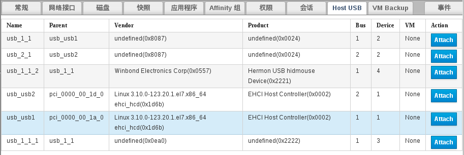

# Host USB 操作界面

**Host USB 操作界面**

1. 进入 EayunOS 4.1 企业级虚拟化管理平台。

2. 选择一台虚拟机。对于所选择的虚拟机，其**迁移选项**的设置必须为**不允许迁移**，并且其状态为 **Up**。

3. 此时在界面下方出现的子标签中，会有名为**Host USB**的标签，选择它。

4. 标签内出现如下内容：

   

5. 图中所显示的设备，为挂载在 EayunOS 4.1 企业级虚拟化宿主机上面的可供穿透至所选虚拟机的设备列表。
   选择所需的 usb 设备，然后点击  按钮。

6. 等待  按钮变成  按钮。此时对应的 usb 设备已经穿透至虚拟机了。

> **警告**
>
> 操作前，请确认将 **Attach** 的 usb 设备为正确的设备。
> 请勿将陌生的 usb 设备 **Attach** 到虚拟机中，否则会出现不可预知的问题。
