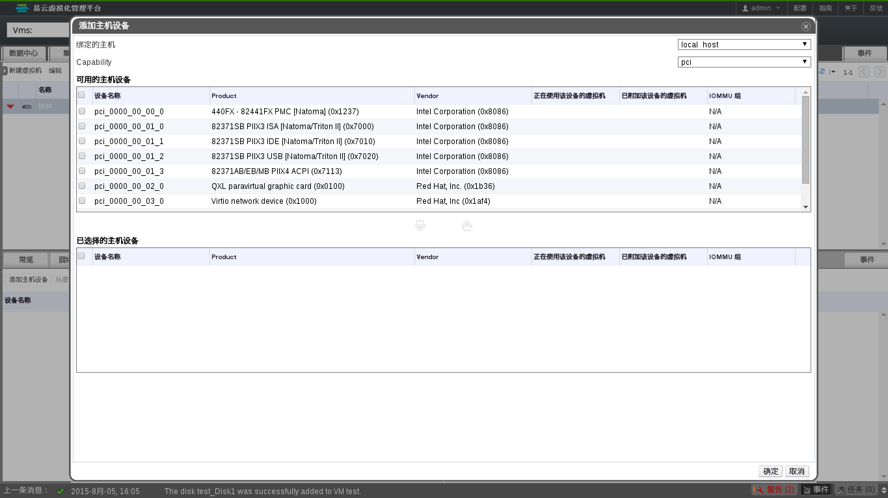

# 让虚拟机使用主机的设备

* 确认宿主机的 IOMMU 功能已经开启，详细信息，请见章节：[启用宿主机的 IOMMU 功能](enable_iommu.md)
* 进入 EayunOS 企业级虚拟化管理平台
* 切换到**虚拟机**主选项卡
* 选择要使用主机设备的虚拟机
* 在下方子选项卡中，选择**主机设备**选项卡，并点击**添加主机设备**按钮，弹出**添加主机设备**窗口。如下图：

  

* 在弹出的窗口中的上半部分选择主机的设备，然后点击窗口中部的图标按钮，该设备将显示在窗口下半部分的列表中，表示该设备已经附加给了虚拟机。
* 点击**确定**按钮，保存配置。
* 启动虚拟机。

> **重要**
>
> 对于显卡设备的穿透，需要额外的配置，详见章节：[显卡设备穿透的注意事项](vga_passthrough_notice.md)

 
> **注意**
>
> * 只能在虚拟机关机的状态下将主机设备附加到虚拟机，用于保存设备穿透的配置
> * 可以将主机设备附加给多个处于关闭状态的虚拟机
> * 一个主机设备同一时间只能附加给一台运行的虚拟机，即：
>   * 虚拟机启动时，如果该虚拟机附加了某一主机设备，且该主机设备没有附加给其它任何处于非关闭状态的虚拟机，虚拟机启动成功，否则虚拟机启动失败。
