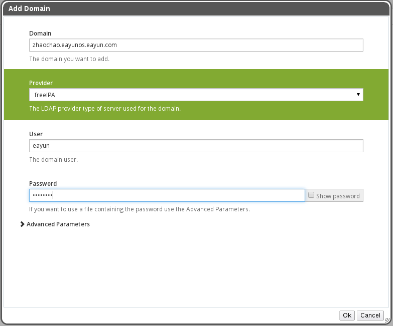
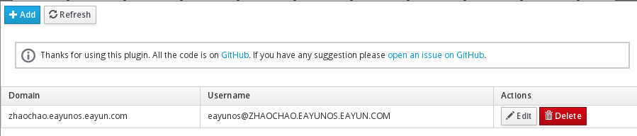

# 添加 FreeIPA 域控

**前提条件**

在添加 FreeIPA 域控之前，需要准备好如下几个条件：

* 搭建好一个 Free IPA 目录服务。

* 在 EayunOS 4.1 企业级虚拟化管理平台环境内设置好目录服务器的 DNS。一般 DNS 在目录服务器上，直接写目录服务器的 ip 地址即可。

**在管理门户内添加一用户域**

1. 进入 EayunOS 4.1 企业级虚拟化管理平台。

2. 切换到 **Domains** 标签。

3. 点击**添加**按钮，弹出**添加域**窗口。

4. 在**域**输入框内填写 FreeIPA 服务的 REALM，如 ```ZHAOCHAO.EAYUNOS.EAYUN.COM```。

5. 在**提供商**内填写提供商的类型，这里选 **freeIPA**。

6. 在**用户**输入框内填写具有添加域权限的用户。

7. 在**密码**输入框内填写上面用户的密码，输入完成后如下图：

   

8. 点击**OK**。

9. 进入 EayunOS 企业级虚拟化管理中心的命令行，执行重启 engine 服务的命令：

   ``` 
   service ovirt-engine restart
   ``` 

10. 等待一段时间之后，域添加成功，并且显示在 **Doamins** 标签内的域列表中：

   
