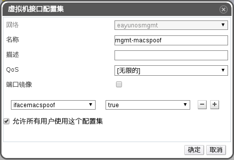
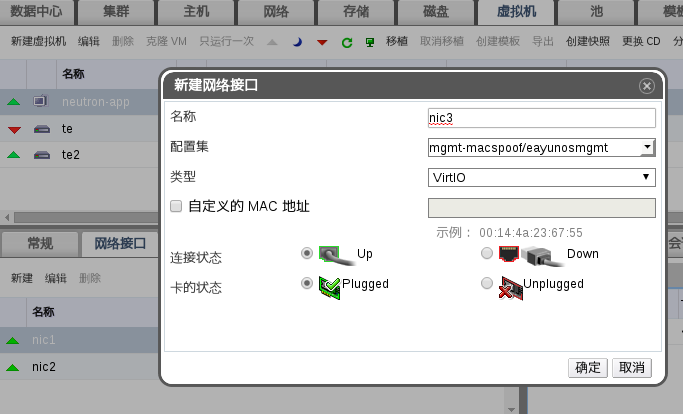

# 设置 neutron 虚拟机网络与外部网络相连

外部网络指的是 neutron 所管理的虚拟机网络之外的网络环境，如 eayunosmgmt 网桥所在的网络，或者用户在 EayunOS 中所设置的其它逻辑网络。这里为方便示例，把 eayunosmgmt 网络充当外部网络来进行设置，设置完成之后，neutron 所管理的虚拟机网络就可以访问外部网络了。

* 为充当外网的逻辑网络（eayunosmgmt）设置一个有 **ifacemacspoof** 项为 **true** 的 vNIC 配置集：

  * 进入 EayunOS 管理平台，选择**网络**标签。
  * 在标签下的列表中选择 **eayunosmgmt** 逻辑网络。
  * 在列表下的子标签中选择 **vNIC 配置集**标签。
  * 点击**新建**按钮，新建一个设置了 **ifacemacspoof** 项为 **true** 的 vNIC 配置集：

    

* 为 neutron 服务器虚拟机添加一块用于连接至外部网络的虚拟网卡：

  * 进入 EayunOS 管理平台，选择**虚拟机**标签。
  * 选择 neutron 服务器虚拟机。
  * 在子标签中选择**网络接口**子标签。
  * 点击**新建**按钮，设置虚拟网卡：

    

    注意：**配置集**应选择上一步中创建的配置集。

* ssh 至 neutron 服务器虚拟机，进行下列设置：

  ~~~
  [user@sshclient]$ ssh admin@172.16.1.168  <-- 这里的 ip 为 neutron 服务器虚拟机的 ip
  admin@172.16.1.168's password: 
  Last login: Tue Nov 17 22:00:38 2015 from 172.16.1.41
  [admin@localhost ~]$ sudo -i
  [root@localhost ~]# . ./keystonerc_admin 
  [root@localhost ~(keystone_admin)]# ovs-vsctl add-port br-ex eth2  <-- 这里 eth2 网卡为上一步中为 neutron 服务器虚拟机添加的网卡
  [root@localhost ~(keystone_admin)]# openstack-config --set /etc/neutron/plugins/openvswitch/ovs_neutron_plugin.ini ovs bridge_mappings extnet:br-ex
  [root@localhost ~(keystone_admin)]# reboot
  Connection to 172.16.1.168 closed by remote host.
  Connection to 172.16.1.168 closed.
  [user@sshclient]$
  ~~~

* 等待 neutron 服务器虚拟机重启完成，再次 ssh 至 neutron 服务器虚拟机，进行下列设置：

  ~~~
  [user@sshclient]$ ssh admin@172.16.1.168  <-- 这里的 ip 为 neutron 服务器虚拟机的 ip
  admin@172.16.1.168's password: 
  Last login: Tue Nov 17 23:47:06 2015 from 172.16.1.41
  [admin@localhost ~]$ sudo -i
  [root@localhost ~]# . ./keystonerc_admin 
  ~~~

  * 创建外部网络，以及设置外部网络的子网信息：

  ~~~
  [root@localhost ~(keystone_admin)]# neutron net-create external_network \
  >    --provider:network_type flat --provider:physical_network extnet \
  >    --router:external=True
  Created a new network:
  +---------------------------+--------------------------------------+
  | Field                     | Value                                |
  +---------------------------+--------------------------------------+
  | admin_state_up            | True                                 |
  | id                        | 6ef4ef3d-0a6d-4168-99a6-ad34d5959a65 |
  | name                      | external_network                     |
  | provider:network_type     | flat                                 |
  | provider:physical_network | extnet                               |
  | provider:segmentation_id  |                                      |
  | router:external           | True                                 |
  | shared                    | False                                |
  | status                    | ACTIVE                               |
  | subnets                   |                                      |
  | tenant_id                 | e8c30d20528a4b2c8f654e89491cd484     |
  +---------------------------+--------------------------------------+
  [root@localhost ~(keystone_admin)]# neutron subnet-create --name public_subnet --enable_dhcp=False \
  >    --allocation-pool=start=172.16.1.170,end=172.16.1.180 --gateway=172.16.1.1 external_network \
  >    172.16.1.0/24  <-- 注意：这里的 --allocation-pool, --gateway, CIDR 的设置要对应你的外部网络的设置
  Created a new subnet:
  +------------------+--------------------------------------------------+
  | Field            | Value                                            |
  +------------------+--------------------------------------------------+
  | allocation_pools | {"start": "172.16.1.170", "end": "172.16.1.180"} |
  | cidr             | 172.16.1.0/24                                    |
  | dns_nameservers  |                                                  |
  | enable_dhcp      | False                                            |
  | gateway_ip       | 172.16.1.1                                       |
  | host_routes      |                                                  |
  | id               | f42da88a-dcb9-4602-ac99-b489f97a25c8             |
  | ip_version       | 4                                                |
  | name             | public_subnet                                    |
  | network_id       | 6ef4ef3d-0a6d-4168-99a6-ad34d5959a65             |
  | tenant_id        | e8c30d20528a4b2c8f654e89491cd484                 |
  +------------------+--------------------------------------------------+
  ~~~

  * 创建路由器：

  ~~~
  [root@localhost ~(keystone_admin)]# neutron router-create router1
  Created a new router:
  +-----------------------+--------------------------------------+
  | Field                 | Value                                |
  +-----------------------+--------------------------------------+
  | admin_state_up        | True                                 |
  | external_gateway_info |                                      |
  | id                    | d83f61ca-51a0-4636-af2e-88198424ea85 |
  | name                  | router1                              |
  | status                | ACTIVE                               |
  | tenant_id             | e8c30d20528a4b2c8f654e89491cd484     |
  +-----------------------+--------------------------------------+
  ~~~

  * 将路由器与外部网络相连：

  ~~~
  [root@localhost ~(keystone_admin)]# neutron router-gateway-set router1 external_network
  Set gateway for router router1
  ~~~

  * 将路由器与 neutron 子网相连：

  ~~~
  [root@localhost ~(keystone_admin)]# neutron router-interface-add router1 \
  >    sub1-foo  <-- 这里的 sub1-foo 为在上一节中设置 neutron 子网时所创建的子网名称
  Added interface 57023bf8-3aea-45aa-a68a-972bce63beb4 to router router1.
  [root@localhost ~(keystone_admin)]# exit
  logout
  [admin@localhost ~]$ exit
  logout
  Connection to 172.16.1.168 closed.
  [user@sshclient]$ 
  ~~~

* 经过如上的设置，neutron 虚拟网络内的虚拟机即可访问外部网络。
