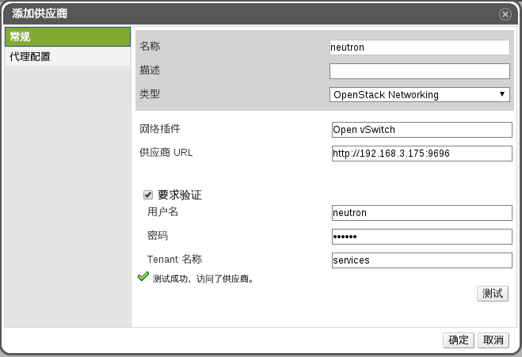

# 导入 neutron 服务至 EayunOS

   * 通过 ssh 终端访问 EayunOS 管理平台，设置 keystone 的 url：

     ```
     [someone@sshclient ~]$ ssh root@eayunosmanager
     root@eayunosmanager's password:
     Last login: Mon Sep 21 11:50:38 2015 from 192.168.3.23
     [root@manager ~]# engine-config -s KeystoneAuthUrl=http://192.168.3.175:35357/v2.0/
     [root@manager ~]# service ovirt-engine restart
     Redirecting to /bin/systemctl restart  ovirt-engine.service
     [root@manager ~]#
     ```

   * 在 EayunOS 管理平台左侧的树形结构中，选择**外部供应商**，然后选择**供应商**主标签，点击**添加**按钮，在弹出框中设置 neutron 服务如下：

     常规：

     

     > **注意**
     >
     > * 图中的**密码**为上面设置过的 keystone 服务的密码。
     > * 图中的**供应商 URL** 中的 IP 地址为 neutron 虚拟机所配置的 IP 地址。
     > * 配置完成后可以点击**测试**以验证 neutron 服务可以访问。

     代理配置：

     

     > **注意**
     >
     > * 图中的**主机**设置的是 neutron 虚拟机所配置的 IP 地址。
     > * 图中的**密码**为 **guest**。

   * 点击**确定**
