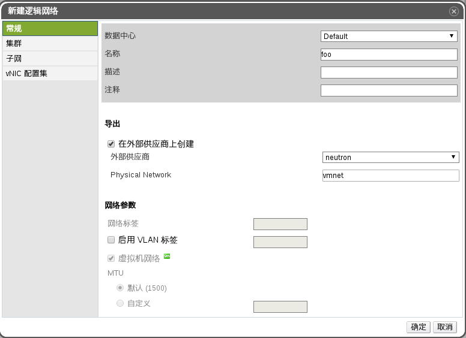

# 创建 neutron 网络

* 打开 EayunOS 管理平台，浏览至**网络**主标签。
* 点击**新建**按钮，弹出**新建逻辑网络**对话框。
* 为新建的 neutron 网络填入一个合适的名称。
* 在对话框中**导出**部分，点击**在外部供应商上创建**勾选框，并在下方**外部供应商**下拉框中选择之前导入的 neutron 外部供应商。
* 在下方的 **Physical Network** 中填写 **vmnet**。

  

* 点击确定，完成 neutron 网络的创建。

