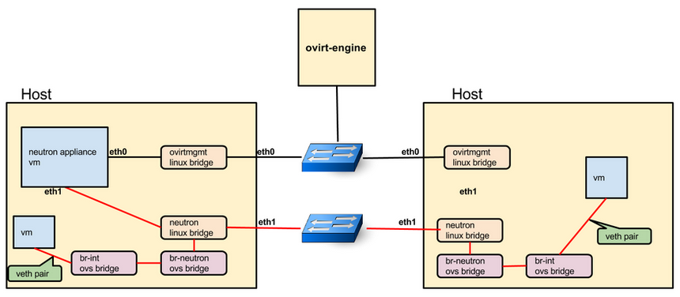
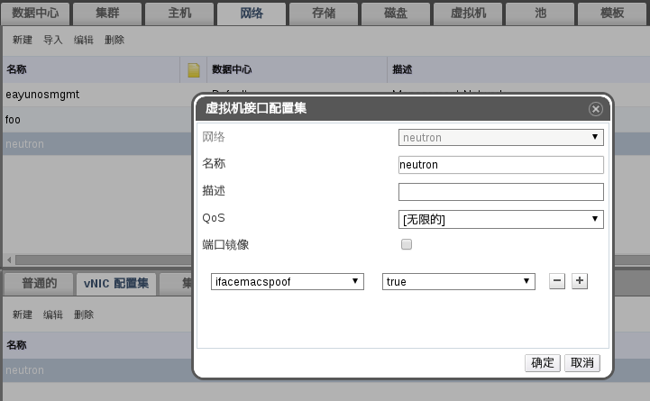
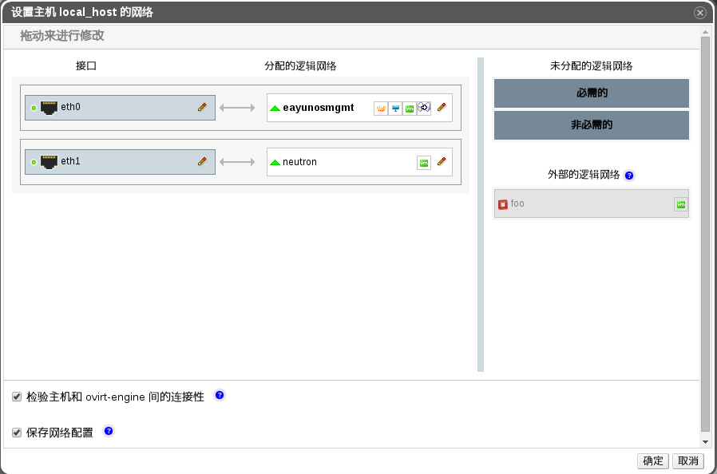

# 准备工作

我们所搭建的 neutron 网络环境的拓扑遵循下图：

从上图可以看出，neutron 需要使用每台 EayunOS 宿主机上的一个物理网卡作为其实现虚拟网络的通道，所以每台使用了 neutron 的宿主机都需要至少两块物理网卡，一块用于与管理网络（eayunosmgmt）通信，一块给 neutron 使用。

基于此，对于每一台需要使用 neutron 服务的宿主机，所需的准备工作如下：

* 确保宿主机有至少两张网卡（系统识别为 eth0 和 eth1），并设置好 eth0 的 ip 地址。
* 将宿主机通过 eth0 网卡的 ip 地址加入到一个集群中。
* 进入 EayunOS 管理平台，切换到**网络**标签。在上述集群所在的数据中心里新建一个名称为 neutron 的逻辑网络。
* 选中上面步骤中新建的逻辑网络，然后在下方选择 **vNIC 配置集**标签，在下方的 vNIC 配置集列表中选中 neutron 配置集，然后编辑它，在弹出窗口中设置 **ifacemacspoof** 参数为 **true**，如下图：

  

* 切换到**主机**选项卡，选中第一步加入的主机，在下方选择**网络接口**标签，然后点击**设立主机网络**，在弹出的窗口中将右侧的 **neutron** 逻辑网络拖拽至左侧的闲置物理网卡 **eth1** 上：

  

* 等待设置完成

至此，准备工作完成，可进入[下一节](using_neutron_template.md)设置 neutron 服务了。 
