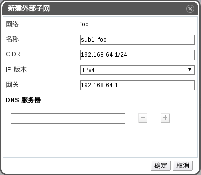

# 创建 neutron 子网

* 打开 EayunOS 管理平台，浏览至网络主标签。
* 点击一个 neutron 网络，如上一章节创建的 **foo**。
* 在下方子标签中点击**子网**标签。
* 在**子网**标签中，点击**新建**按钮，弹出对话框。
* 在对话框中设置好子网**名称**，**CIDR**，**IP 版本**，**网关**等参数。如下：

  

  > **注意**
  >
  > 所创建的子网不要与当前环境下的其他子网有重复。

* 点击**确定**按钮，完成子网的创建。

至此，创建有子网的 neutron 网络，即可被虚拟机使用。在为虚拟机新建网卡时，选择 neutron 网络所对应的网络配置集即可。虚拟机就可以使用 neutron 网络中的如 dhcp 服务等功能了。
