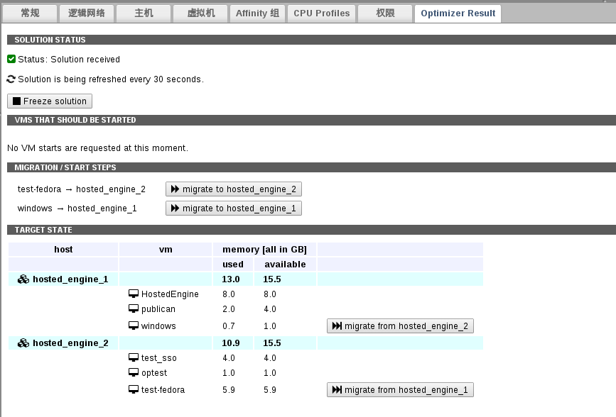

# 智能调度服务界面

**智能调度服务界面及使用**

1. 切换到**集群**选项卡

2. 选择一个集群

3. 选择 **Optimizer Result** 子标签

4. 此时，可以看到如下界面：

   

   **Optimizer 界面**

   * **SOLUTION STATUS**：显示的是智能调度服务的状态，以及调度策略运算结果的刷新频率。

     > **注意**
     >
     > 由于智能调度服务只是运算虚拟机启动与分布的最优策略，而不会对当前集群做任何动作（操作需要用户手动执行）。

   * **VMS THAT SHOULD BE STARTED**：显示触发智能调度服务计算策略的待启动或正在启动的虚拟机。

     > **注意**
     >
     > 只有给虚拟机设置了 **Optimize Start** 的情况下，该虚拟机正在启动（还未启动完）的时候才有可能出现在该位置。

   * **MIGRATION / START STEPS**：显示智能调度服务计算出来的对当前集群分布作出的优化建议（迁移虚拟机）。点击相应按钮即采纳了智能调度服务的迁移虚拟机建议。

   * **TARGET STATE**：显示智能调度服务计算出来的对当前集群分布的优化后的状态。点击相应按钮即采纳了智能调度服务的迁移虚拟机建议。
