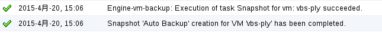
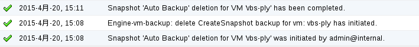

# 设置虚拟机快照备份

**设置虚拟机快照备份**

1. 打开 EayunOS 4.1 企业级虚拟化管理平台，切换到**虚拟机**主选项卡。

2. 选择一台待备份的虚拟机，在下方显示的虚拟机的子标签中，选择**虚拟机备份**子标签。

3. 勾选**启用**勾选框。

4. 在**备份策略**下拉列表中选择**增量备份（快照）**。

5. 在**时间计划**设置区域内设置**备份周期**以及**时间**。

6. 如有需要，在**备份限制**设置区域内设置**保留备份数**或者**保留备份天数**。

7. 点击**保存更改**按钮。

8. 此时浏览器会弹出一个弹出框提示保存成功。

设置完成备份以后：

* 设置的虚拟机备份保存成功，此时可以到**虚拟机备份**主选项卡内浏览到刚才设置的备份信息。

* 到了**时间计划**指定的时间计划时，备份开始执行，此时可以在**事件**标签或者**事件**栏内看到指定要备份的虚拟机自动执行快照的信息：

  

  > **注意**
  >
  > 指定要备份的虚拟机自动执行快照的名称为“Auto Backup”，
  > 该名称可方便用户辨别虚拟机的哪些快照是用户手动执行的，哪些是自动执行的。

* 等待一段时间，快照执行完成，此时可以在**事件**标签或者**事件**栏内看到指定要备份的虚拟机快照完毕的信息：

  

* 若虚拟机的快照备份数量或者备份时间超过了该虚拟机备份设置中**备份限制**的限制条件，将会自动删除备份。例如：

  > 虚拟机在**备份限制**设置区域选择了**保留备份数**，且设置的保留备份数为 1。
  >
  > 若此时该虚拟机已经有两个自动执行的备份，将会自动删除掉时间较早的那一个备份。
  > 删除的时候可在**事件**标签或者**事件**栏内看到指定虚拟机自动执行快照删除的信息：
  >
  > 

