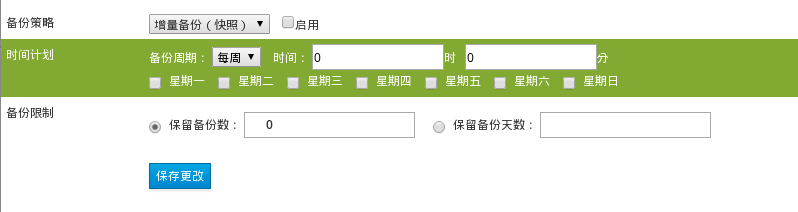

# 虚拟机备份的操作界面

**虚拟机备份的操作界面**

1. 打开 EayunOS 4.1 企业级虚拟化管理平台。
2. 切换到**虚拟机**主选项卡。
3. 选择一台虚拟机，在下方显示出虚拟机的子标签。
4. 在虚拟机的子标签中选择**虚拟机备份**子标签。
5. 浏览到如下界面：

   

在上图中：

* **启用**按钮：只有勾选了它，备份策略才能生效。
* **备份策略**下拉选框：可以选择**增量备份（快照）**和**完全备份（导出）**中的一个。
   * **增量备份（快照）**：代表虚拟机备份的方式为快照，即在备份操作被触发的时候，对虚拟机作快照。采用快照的方式备份的优点是备份速度快，缺点是该备份没有将虚拟机的虚拟磁盘文件以及虚拟机的配置信息放到另一个存储介质（如导出域）上，而是直接在虚拟机正在运行的数据存储域上做了一个增量备份文件。
   * **完全备份（导出）**：代表虚拟机备份的方式为导出，即在备份操作被触发的时候，将虚拟机导出到导出域中。采用导出的方式备份的优点是将虚拟机的虚拟磁盘文件以及虚拟机的配置信息放到另一个存储介质（导出域）上，缺点是备份速度慢。

   > **注意**
   >
   > **备份策略**下拉选框不是虚拟机备份策略的保存属性，而是虚拟机备份的两套策略，每套策略都保存了各自的备份策略参数，可通过改变**备份策略**下拉选框的项目来查看对应的策略设置。

    
   > **警告**
   >
   > 要使用虚拟机的**完全备份（导出）**策略，需要预先在所备份的虚拟机所在的数据中心配置好一个导出域，否则设置的备份不会执行。

* **时间计划**：设置备份的周期以及时间。
   * **备份周期**：可以选择**每周**或者**每天**。如果选择了**每周**，备份的时间设置范围将按照周为周期；如果选择了**每天**，备份的时间设置范围将按照日为周期。
   * **时间**：设置在备份周期的范围内，虚拟机备份具体发生的时间。
* **备份限制**：对所备份的虚拟机的备份数量进行的限制，该设置可以控制备份对存储所占用的空间。
   * **保留备份数**：对所备份虚拟机的备份数量进行限制，
   * **保留备份天数**：对所备份虚拟机的备份时间进行限制，即只保留备份于**保留备份天数**所设定的天数之内的备份。

   > **注意**
   >
   > 如果**备份策略**选择的是**增量备份（快照）**，则**备份限制**所限制的备份对象为所备份虚拟机的快照备份。
   > 如果**备份策略**选择的是**完全备份（导出）**，则**备份限制**所限制的备份对象为所备份虚拟机导出至导出域的备份。

    
   > **重要**
   >
   > **备份限制**只会限制自动备份的**增量备份（快照）**所产生的虚拟机快照和**完全备份（导出）**所产生的虚拟机导出备份，对于用户所做的快照以及导出的虚拟机备份，不在**备份限制**限制的范围之内。
* 点击**保存更改**按钮来保存设置。
