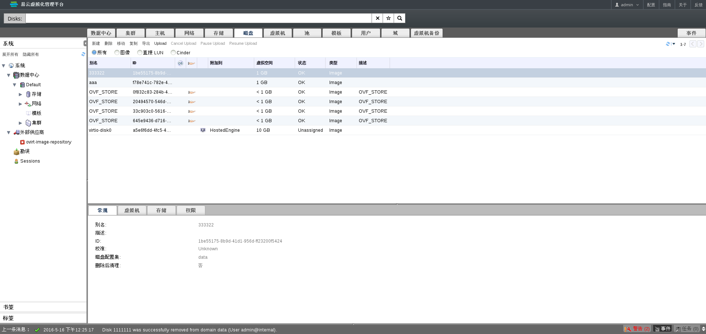
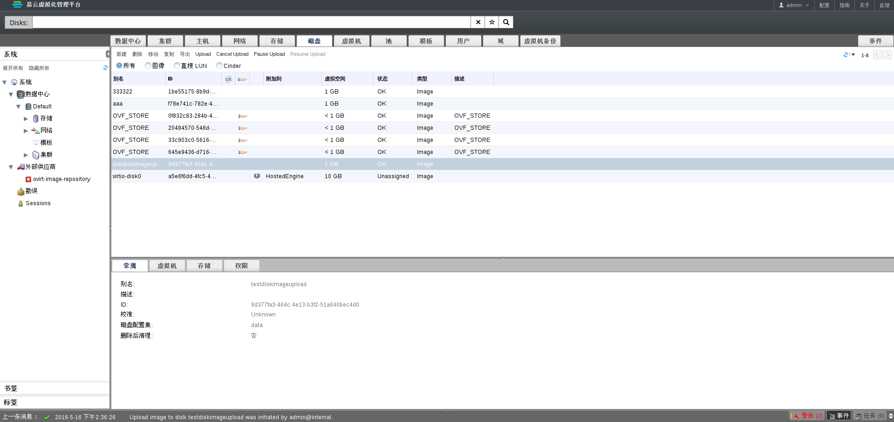

# 关于磁盘镜像上传

在EayunOS4.2之前的版本中，导入一个虚拟机磁盘到存储域中需要从存在的存储中通过virt-v2v或者其它手动的操作来实现，但是现在可以通过点击前端界面中磁盘上传按钮来实现磁盘镜像自动上传到虚拟化环境中。

# 磁盘镜像上传

* 进入 EayunOS 企业级虚拟化管理平台
* 切换到**磁盘**主选项卡

  可以看到已经存在虚拟磁盘列表如图所示：

    

* 点击**Upload**按钮弹出**Upload Image**对话窗口

  选择需要上传的磁盘镜像，填写相关选项，如图所示：

    

* 点击**Upload Image**对话框中的**确定**按钮开始磁盘镜像上传

  此时**Resume Upload**按钮为不可选状态，如图所示：

    

  磁盘镜像上传完成之后，按钮**Cancel Upload**，**Pause Upload**，**Resume Upload**均恢复成不可选状态。至此，磁盘镜像上传完成，如图所示：

    
