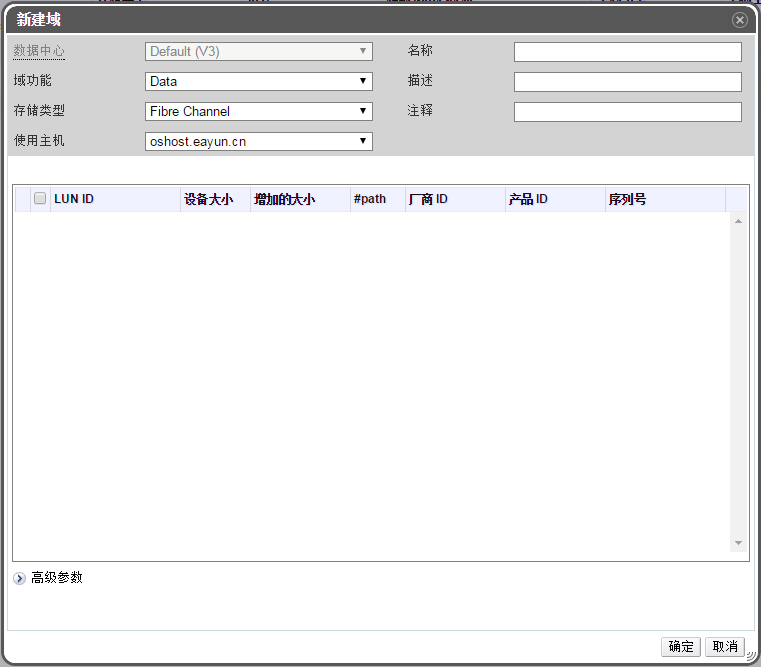

# 添加 FCP 存储

**概述**

EayunOS 平台通过从已存在的 LUN 组成的逻辑卷组创建存储域来支持 FCP
存储。同一时间，逻辑卷组和 LUN 都只能附加到一个数据域中。

EayunOS系统管理员需要对存储域的网络有个知识概念。SAN 使用光纤通到协议（FCP）为主机与共享外部存储域提供通信。所以这种存储被成为FCP存储。

>**注意**
>
>只能添加 iSCSI 存储域到类型为 iSCSI 的数据中心。

1. 点击**存储**标签，列出目前存在的所有存储域。

2. 点击**新建域**按钮打开**新建域**窗口，如图：

 

 **添加 FCP 存储**

3. 输入存储域的**名称**。

4. 在**数据中心**下拉框选择一个 FCP
类型的数据中心，如果暂时没有该类型的数据中心，先选择 **(none)**。

5. 从**域功能/存储域类型**下拉菜单中选择 **Data/Fibre Channel**。选择**格式**。所选数据中心不匹配的存储域不会显示。

6. 在**使用主机**下拉菜单，选择适当的主机。

 > **重要**

 > 与存储域的通信都通过所选择的*使用主机*而 不是通过 EayunOS
 > 系统本身。所以至少数据中心中必须有一台活动主机才能够配置存储。

7. 如果之前操作选择了 **Data/Fibre Channel** 存储类型，则新建域窗口会自动显示发现的 targets 中没有使用的  LUN。选择 **LUN ID** 复选框选择可用的 LUNs。

**结果**

**存储**标签列表中显示出了新建的 FCP 存储域，一开始是 **Locke** 状态的，准备就绪后将自动附加到数据中心上。

