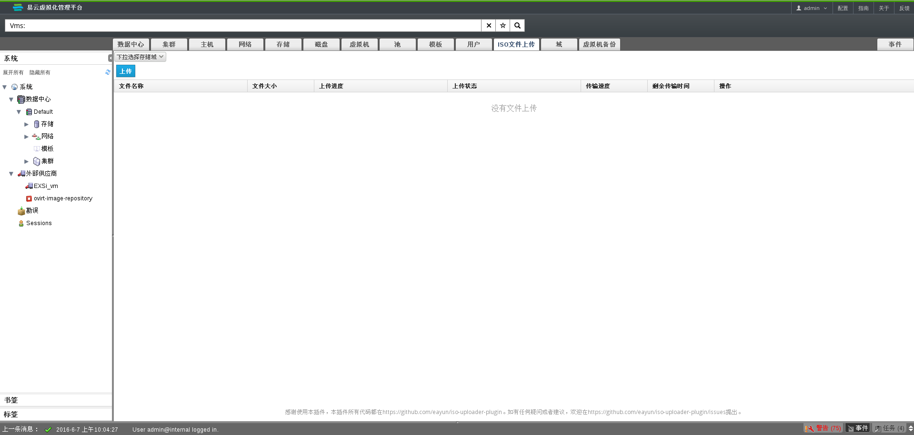
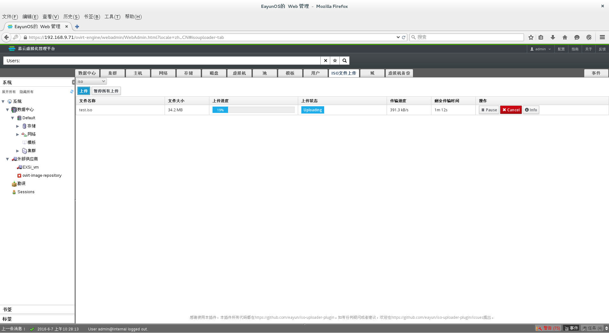
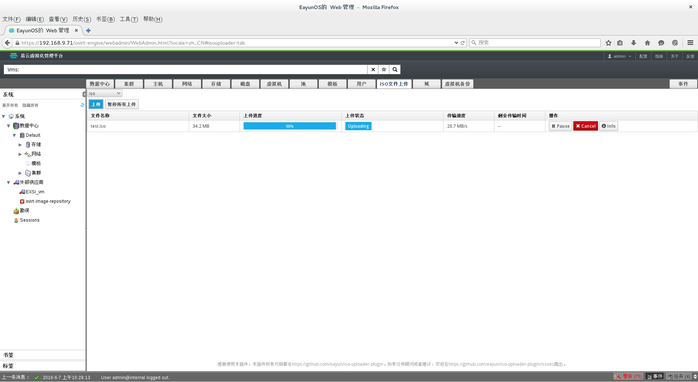
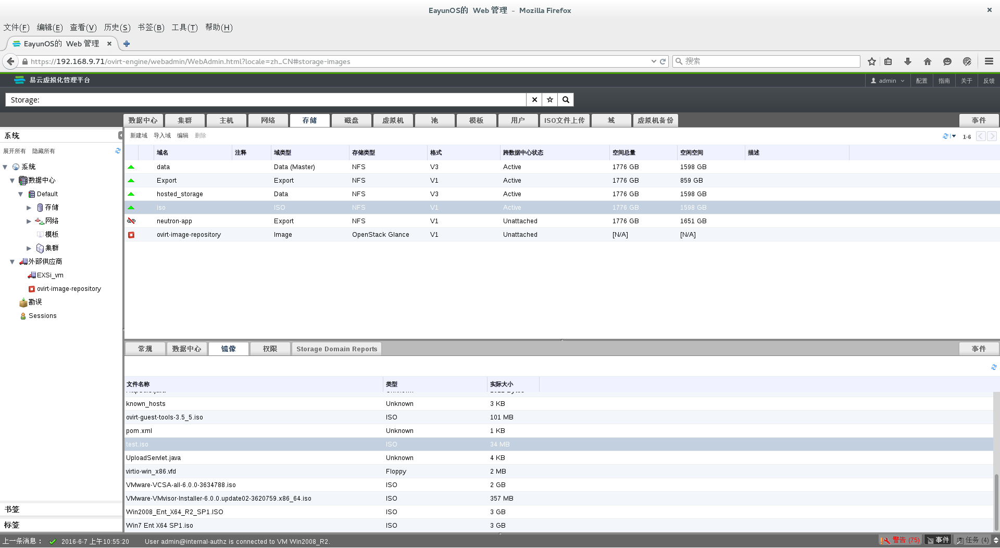

# 关于ISO文件上传

在EayunOS4.2之前的版本中，上传一个ISO文件到ISO存储域只能通过命令行使用ISO Uploader tool或者手动拷贝ISO Image来实现，但是现在可以通过点击前端界面中ISO文件上传按钮来实现ISO文件自动上传到ISO存储域中。

# ISO文件上传

* 进入 EayunOS 企业级虚拟化管理平台
* 切换到**ISO文件上传**主选项卡

  可以看到ISO文件上传所需要的操作项，如图所示：

    

* 点击**下拉选择存储域**

  显示一个包含所有激活状态下的iso存储域的列表框，选择iso文件所要上传的存储域，如图所示：

    

* 点击**上传**按钮，选择所需上传文件进行上传，如图所示：

    

* 若在上传过程中刷新页面或者切换主选项卡，上传会被置为暂停状态。如需继续上传此文件需要重新选择存储域，点击**上传**按钮选择之前的上传文件，文件将从断点处继续上传，如图所示：

    

* 文件上传完成，如图所示：

    

* 切换到**存储**主选项卡，选择**iso**存储域，选择**镜像**子选项卡，验证iso文件上传成功。

  在**镜像**子选项卡中可以看到上传的**test.iso**文件，如图所示：

    
