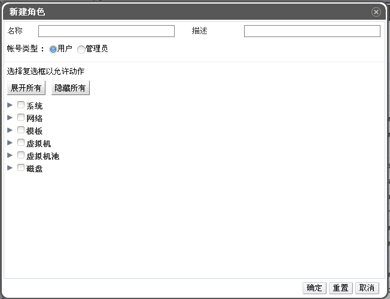

# 创建一个新的角色

**摘要** 
若果你所需的角色不在 EayunOS 企业级虚拟化的默认角色列表中，您可以新建一个新的角色，并对其进行定制来满足您的需求。

**新建一个新的角色**

1. 在头部栏中，点击**配置**按钮，会弹出**配置**窗口。该窗口显示一组默认的用户角色和管理员角色，以及任何自定义角色。

2. 点击**新建**，显示新建对话框。
 
**新建角色窗口**
3. 输入新角色的**名称**和**描述**。

4. 选择**帐户类型**（**管理员**或**用户**）。

5. 点击**展开所有**或**隐藏所有**按钮来查看**允许操作的复选框**列表中列出来的更多的对象权限。

6. 对于每个实体，选择或者清除复选框来完成对该角色的配置。

7. 点击**确定**提交更改，新的角色将显示在角色列表中。

**结果** 
您已经成功创建了拥有特定资源权限的角色。你可以将该角色分配给用户了。
