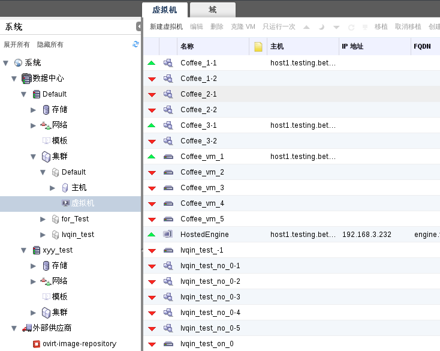
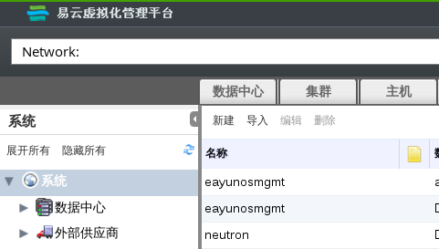

# 树形结构和平面视图

管理员门户提供了两种模式来管理您的资源: 树形模式和平面模式。树形模式会在每个数据中心的层次视图中显示资源，从最高级别的数据中心到最低级别的独立的虚拟机。我们更推荐用树形模式来进行绝大多数的操作。

**树形模式**

平面模式允许您在数据中心或存储域中进行搜索操作。它不会把您限制在一个单一的分级结构中来查看资源。例如，您可能需要在数据中心和集群中查找所有 CPU 使用率超过 80% 的虚拟机，或搜索所有利用率最高的主机。利用平面模式来查询是可以做到的。另外，像**池**和**用户**这样的特殊对象不在数据中心的层级结构下，并且只能在平面模式中对它进行访问。

为了访问平面模式，在屏幕左侧的**树形**面板上点击**系统**。如果您进入了平面模式，就可以看到**池**和**用户**资源标签。

