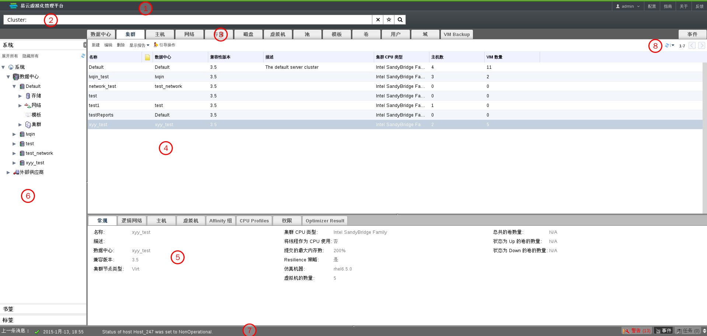

# 管理员门户的要素

EayunOS 企业级虚拟化的管理门户由相关联的面板和各种菜单组成。主要有两种使用方式：树形模式和平面模式。树形模式是以层次结构显示一个数据中心的内容，而平面结构则在一个单一的列表中显示了数据中心的所有资源。你可以在这个结构上操作属于该数据中心的一些元素，我们主要推荐使用树状模式来管理 EayunOS 虚拟化管理中心。下图显示了用户图形界面的各个元素:

**图形用户界面的主要组成部分**

1. **头**
头包括以了当前登录用户的名称，**登出**按钮，**关于**按钮，**配置**按钮和和**指南**按钮。点击**关于**按钮会显示出 EayunOS 企业级虚拟化的系统版本信息，点击**配置**按钮允许您配置用户的角色，点击**指南**按钮会打开一个链接，即 EayunOS 企业级虚拟化管理系统使用文档的页面，你可以在上面查找到该系统的使用手册。

2. **搜索栏**
您可以使用搜索栏来创建搜索条件，例如 EayunOS 企业级虚拟化环境中的主机和集群。您可以用 host 关键字这样简单的字样搜索所有的主机，还可以用更复杂的查询条件来搜索符合特点条件的资源。当您输入搜索条件的每个部分的时候，内置的搜索引擎会打开一个下拉框自动提示可能想要搜索的结果。点击搜索栏右边的的星图标，你可以把这次搜索保存为书签，方便下次查看。

3. **资源标签**
所有的资源都可以通过相应的标签进行管理。**事件**标签允许您查看每个资源的事件。管理员门户提供了如下标签：**数据中心**,**集群**，**主机**，**网络**，**存储**，**磁盘**，**虚拟机**，**池**，**模版**，**卷**，**用户**，**域**，**VM Backup**和**事件**。

4. **结果列表**
您可以通过在结果列表中选择一项，多项或者所有项，并点击相关按钮来执行某操作。关于选中的资源的一些信息就会在详细信息面板上显示出来。

5. **详细面板**
详细信息面板显示了在结果列表中选中项的详细信息，如果您没有在结果列表中选择任何一项，这个详情面板是隐藏起来的。如果您在结果列表中选择了多项，那么详情面板将只显示您选择的第一项的详细信息。

6. **系统/书签/标签框**
“系统面板”以导航层次结构显示了 EayunOS 企业级虚拟化环境中的资源。书签通常用来保存频繁使用或者教复杂的搜索条件以便可以重复使用。您可以增加, 编辑或者删除书签。标签可以应用到资源组中并且可用来搜索所有用这个标签标记了的资源。使用系统/书签/标签面板右上角的箭头可以实现最小化。

7. **警告/事件框**
**警告**标签会列出所有紧急事件, 例如系统的错误和警告信息。**事件**标签可以列出所有资源中的事件。**任务**标签会列出当前运行着的所有任务。您可以通过点击放大/缩小按钮来显示这个面板。

8. **刷新间隔**
您可以通过门户右上方**刷新间隔**下拉菜单来设置时间间隔，它是以秒为单位的。为了避免用户进行一个操作与这个操作被门户所显示之间的时间的延迟，门户会自动对一个操作或者事件进行刷新，而不受所选时间间隔的限制。

> **重要**
>
> 在浏览器中，管理门户要求的最小分辨率是 1024x768。如果系统的分辨率小于这个数值，管理门户的显示可能会有一些问题。

 
> **注意**
>
> 在 EayunOS 4.1 企业级虚拟化中，管理门户的显示已经被改进。它现在可以在较低的显示分辨率或非最大化窗口中正确显示。当分辨率太低或窗口空间太小，无法显示所有菜单时，您可以通过滚动页，或使用下拉菜单来显示所有的标签页。另外，**系统/书签/标签框**也可以被最小化以腾出额外的空间。

