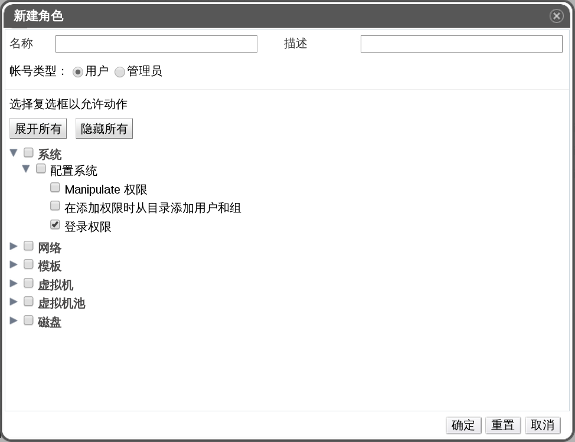

# 用户角色和用户权限实例

下面的实例阐述了在使用了本章讲解的权限系统的特性为不同的场景应用权限控制。

> **集群权限**
>
> A 是一个公司会计部门的系统管理员。对于她的部门来说，所有的虚拟资源都运行在一个名称为**会计**的EayunOS 企业级虚拟化**集群**中。在会计集群中，她的角色是**ClusterAdmin**，所以她可以管理该集群的所有虚拟机（虚拟机是集群的子对象）。管理虚拟机包括编辑，新建，或删除虚拟资源（例如磁盘）和做快照。但是不允许她管理该集群以外的任何资源。由于**ClusterAdmin**是一个管理员角色，所以还允许她通过使用管理员门户来管理这些资源，但是不允许她通过用户门户访问。

 
> **虚拟机高级用户权限**
>
> B 是会计部门的软件开发人员。他利用虚拟机对他的软件进行编译和测试。A 为 B 新建了一个名叫 **Bdesktop** 的虚拟机。在这台 **Bdesktop** 的虚拟机上，B 的角色是 **UserVMManager**，所以他可以通过用户门户访问这台虚拟机。由于他具有**UserVMManager**权限，所以他可以修改虚拟机并对其添加一些资源（例如新建虚拟磁盘）。又因为**UserVMManager** 是一个用户角色，所有他是不可以通过管理员门户来访问这台虚拟机的。

 
> **数据中心高级用户权限**
>
> C 是办公室经理，她除了做其本职工作还会协助人力资源经理进行招聘的工作（例如安排面试和跟踪参考检查）。根据公司政策，C 需要利用一个特殊的应用程序来开展她的招聘工作。
>
> 虽然 C 在处理办公室工作的时候有一台属于她自己的机器，但是她想专门为招聘工作创建一台独立的虚拟机。她在其新虚拟机所在的那个数据中心中的权限是 **PowerUserRole**。这是因为为了创建一台新的虚拟机，她需要更改数据中心中的几个组件，包括在存储域中创建虚拟机磁盘镜像。
>
> 请注意一点，上述给她分配的权限和分配给她 **DataCenterAdmin** 权限是不同的。对于数据中心的高级用户来说，C 可以登录到用户门户中并可对在数据中心下的虚拟机进行虚拟机特有的操作。但是她不能够执行数据中心级别的操作，例如往数据中心上挂载主机和存储。

 
> **网络管理员权限**
>
> D 是 IT 部门的网络管理员。她的日常职责包括创建，操作和删除 EayunOS 企业级虚拟化环境中的网络。对于她的角色来说，她需要每个资源上资源和网络的管理权限。例如，如果 D 具有 IT 部门数据中心的 **NetworkAdmin** 权限，她就可以在数据中心中新建以及删除网络，还可以为所有属于该数据中心的虚拟机附加和分离网络。
>
> 除了管理公司的虚拟架构的网络，D 还有一个向她报告工作的初级网络管理员。这位初级网络管理员，E，他为公司内部的培训部门提供了一小部分的虚拟环境。D 为 E 能够管理内部培训部门的虚拟机而为其分配了 **NetworkUser** 权限和 **UserVMManager** 权限。有了这些权限，E 可以执行一些简单的管理任务，例如通过用户门户在虚拟机上新建网络接口。但是，他没有权限去更改虚拟机运行着的虚拟机所在的那台主机上的网络，也不能变更虚拟机所属的数据中心中的网络。

 
> **自定义角色权限**
>
> F 在 IT 部门工作，其职责是管理 EayunOS 企业级虚拟化管理中心中的用户账户。她需要权限来创建用户并为用户分配恰当的角色和权限。她自己没有使用任何一台虚拟机，而且她应该不能够访问并管理主机，虚拟机，集群或数据中心。但是这里并没有可以提供给她这种特殊权限的内置角色。所以必须要站在 F 的立场，为其定义适合她的一组权限。
>

>
**UserManager 自定义角色**
>
上图显示的 **UserManager** 自定义角色允许对用户，权限以及角色进行操作。这些操作是基于**系统**下的 - 上图显示除了层级结构的顶级对象。所以也就意味着她的操作权限可以扩大到系统下的所有对象。这个角色的账户类型被设置为 **Admin**。这意味着当她被分配了这个权限后，F 只能通过管理员门户访问，而不能通过用户门户进行管理和访问。

