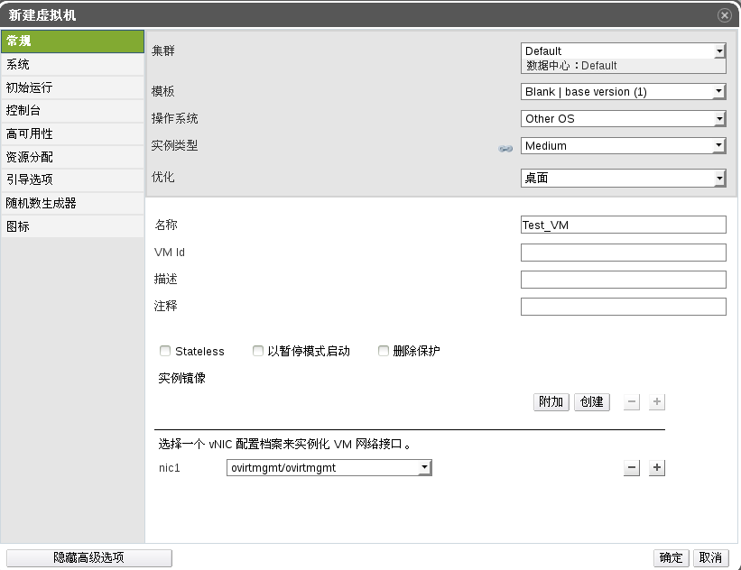

## 测试案例1

* 创建一个没有磁盘的虚拟机

  1.首先进入管理平台的用户门户如下图所示:

   

  2.点击**新建虚拟机**按钮弹出新建虚拟机窗口，如下图所示：

   

  配置好相关选项，点击**确定**按钮后，虚拟机创建成功。用户门户如下图所示：

   

  可以看到新创建的名为Test_VM的虚拟机显示在主界面中。

  3.在详情面板中的**磁盘**标签中可以查看虚拟机磁盘信息，如下图所示：

   

  可以看到名为Test_VM的虚拟机没有创建任何磁盘。

* 克隆虚拟机

  点击**克隆VM**按钮，弹出克隆虚拟机按钮，如下图所示：

   

  输入克隆虚拟机的名称，点击**确定**按钮克隆虚拟机。用户门户的主界面如下图所示：

   

  可以看到名为Test_VM_Clone的克隆虚拟机显示在主界面中。

* 验证克隆虚拟机没有磁盘

  选中Test_VM_Clone虚拟机，在详情面板中选中**磁盘**标签显示克隆虚拟机磁盘的详细信息，如下图所示：

   

  可以看到名为Test_VM_Clone的虚拟机没有创建任何磁盘。

* 验证克隆虚拟机的所有参数都被克隆

  1.选中Test_VM虚拟机，点击**编辑**按钮，弹出编辑虚拟机窗口，显示Test_VM虚拟机参数信息，如图所示：

   

  2.选中Test_VM_Clone虚拟机，点击**编辑**按钮，弹出编辑虚拟机窗口，显示Test_VM_Clone虚拟机参数信息，如图所示：

   

  3.可以看出两台虚拟机除了名称和VM Id不同，其它参数都相同。
