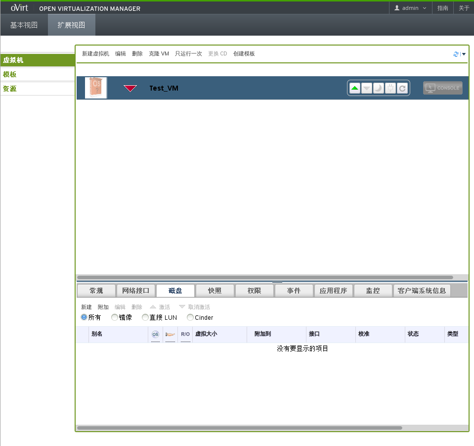
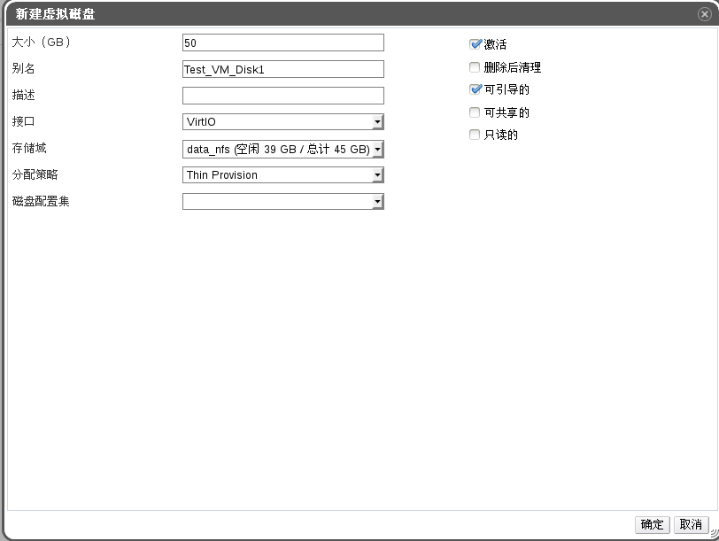
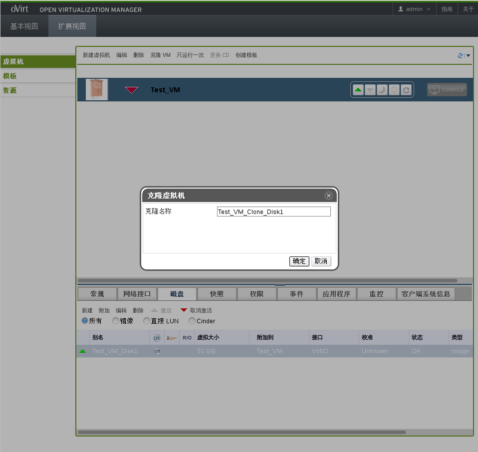
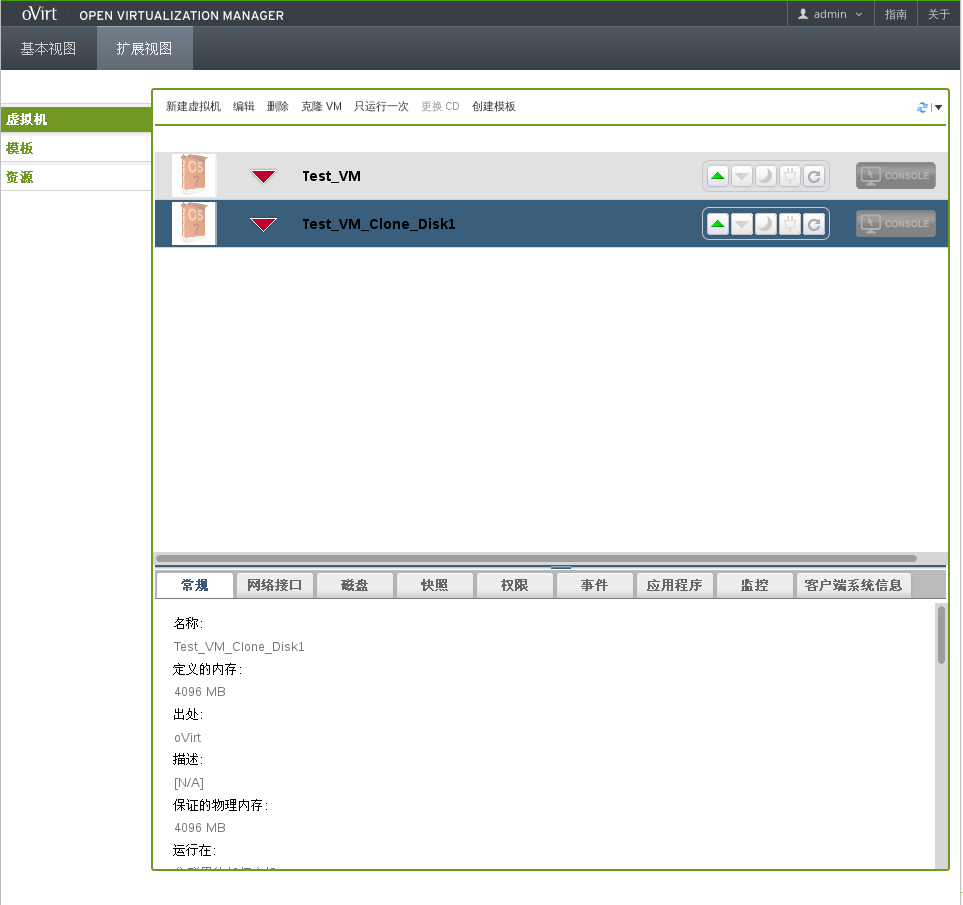
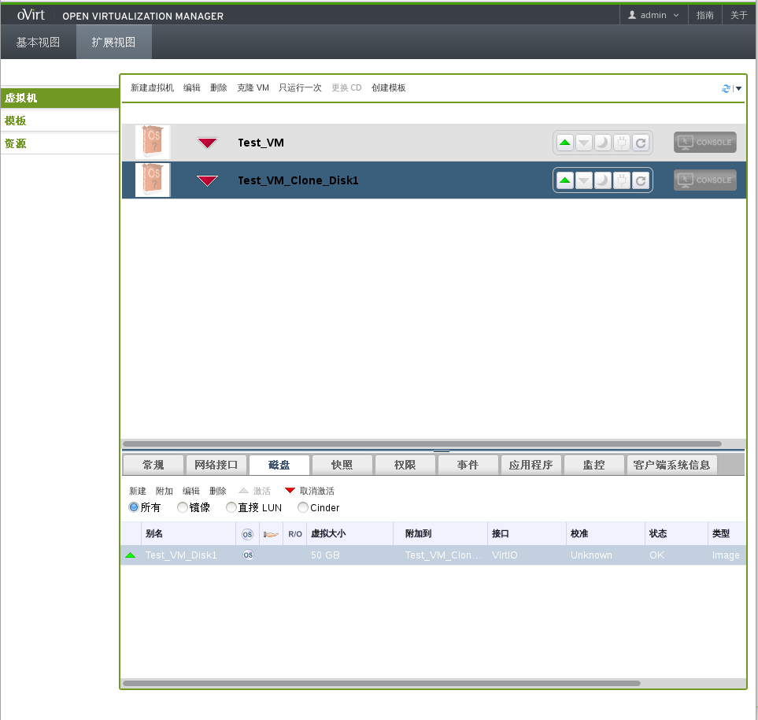
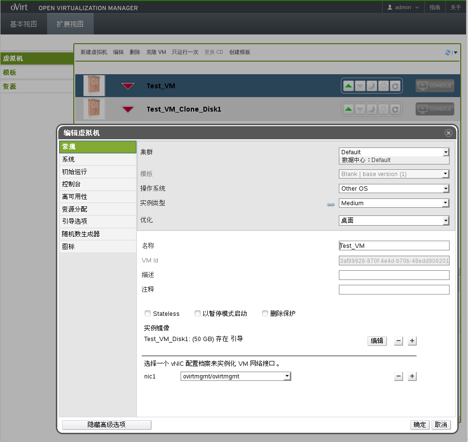
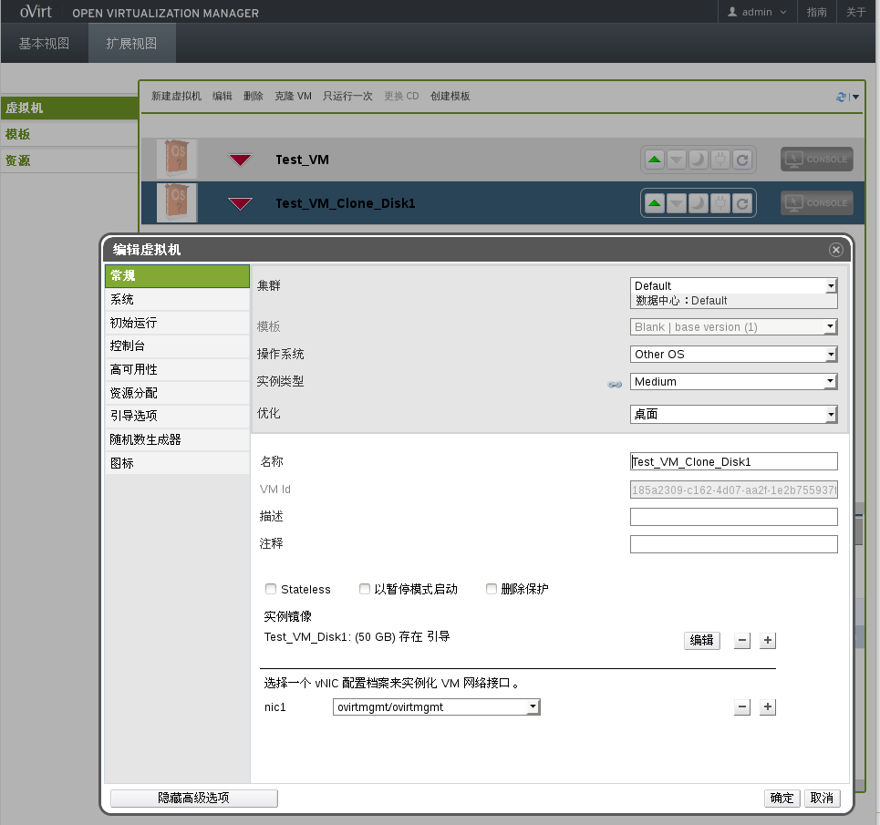

## 测试案例2

* 创建一个具有一个磁盘的虚拟机

  1.选中Test_VM虚拟机，在详情面板中点击**磁盘**标签，显示Test_VM磁盘信息，如下图所示：

   

  2.点击详情面板中的**新建**按钮，弹出新建虚拟磁盘窗口，如图所示：

   

  填写相关参数，点击**确定**按钮，创建虚拟机虚拟磁盘。

  3.虚拟磁盘成功创建并激活，如图所示：

   

* 克隆这个虚拟机

  选中Test_VM虚拟机，点击主界面中的**克隆VM**按钮，弹出克隆虚拟机窗口，如图所示：

   

  填写虚拟机的名称，点击**确定**按钮，克隆名为Test_VM_Clone_Disk1的虚拟机，如图所示：

   

* 验证克隆的虚拟机有一个虚拟磁盘

  选中Test_VM_Clone_Disk1虚拟机，在详情面板中点击**磁盘**标签，显示克隆虚拟机磁盘信息，如图所示：

   

  可以看到克隆虚拟机有一个虚拟磁盘。

* 验证克隆虚拟机的所有参数都被克隆

  1.选中Test_VM虚拟机，点击**编辑**按钮，弹出编辑虚拟机窗口，显示Test_VM虚拟机参
数信息，如图所示：

   

  2.选中Test_VM_Clone_Disk1虚拟机，点击**编辑**按钮，弹出编辑虚拟机窗口，显示Test_VM_Clone_Disk1虚拟机参数信息，如图所示：

   

  3.可以看出两台虚拟机除了名称和VM Id不同，其它各标签参数都相同。
