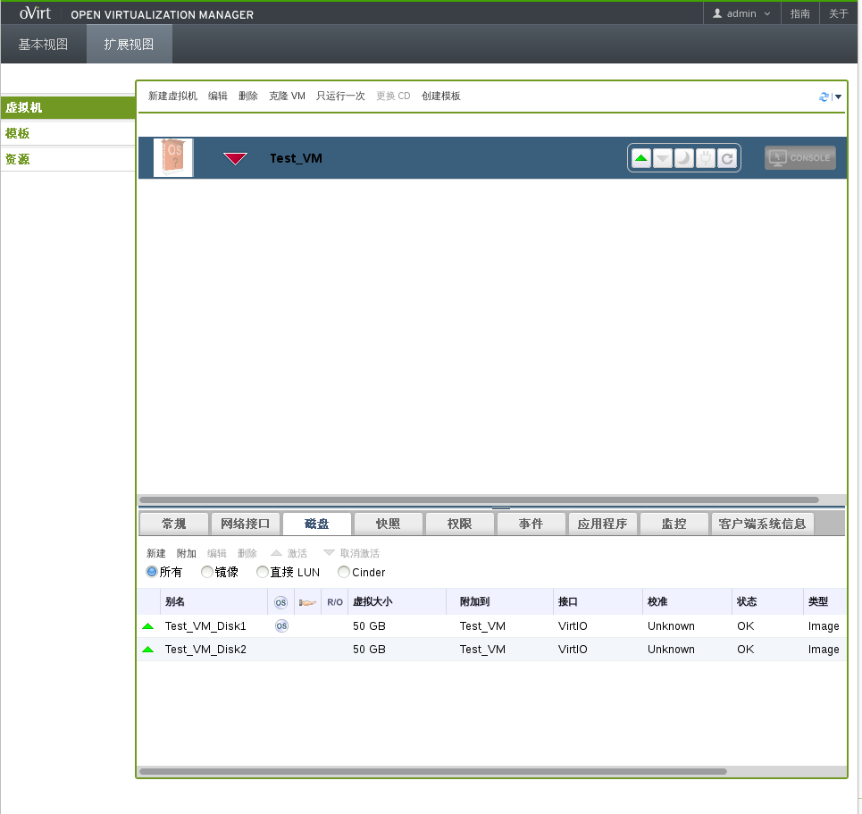
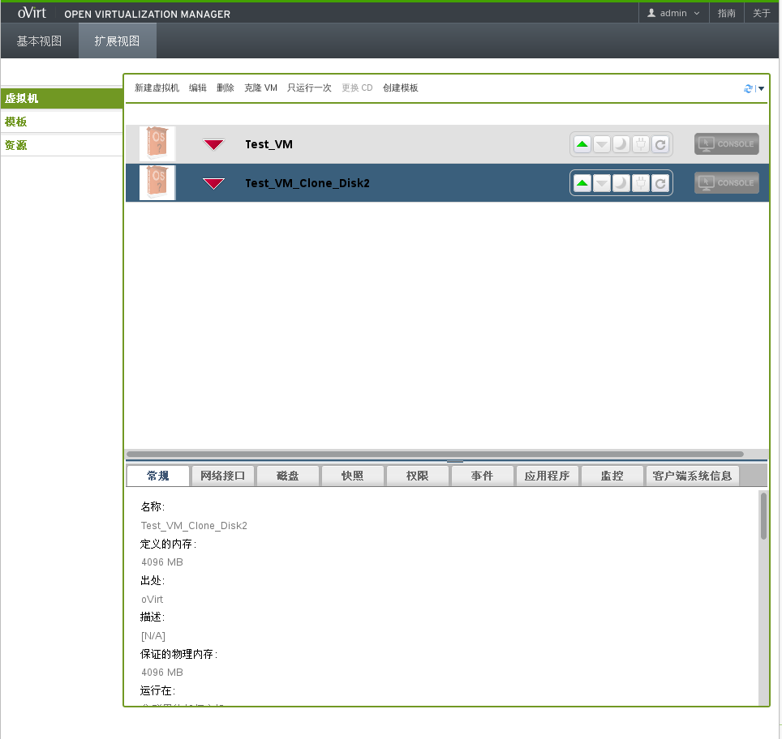
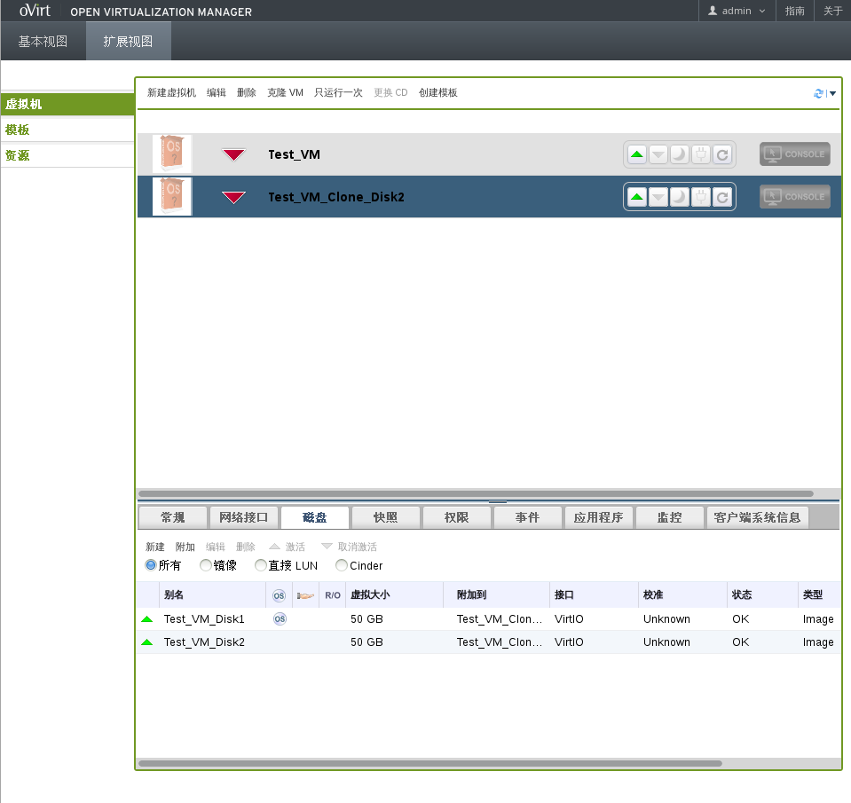
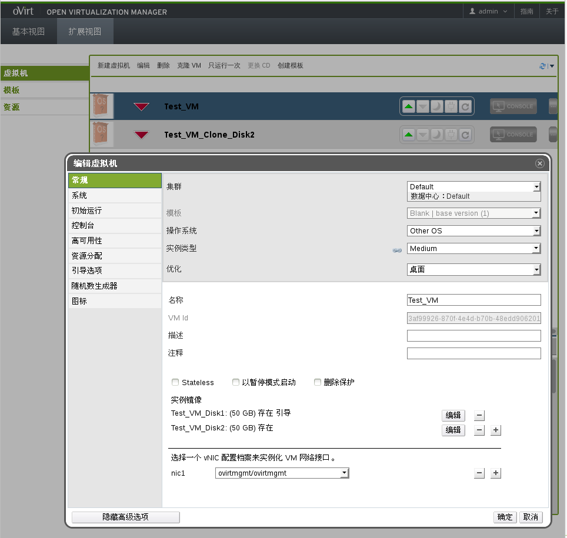
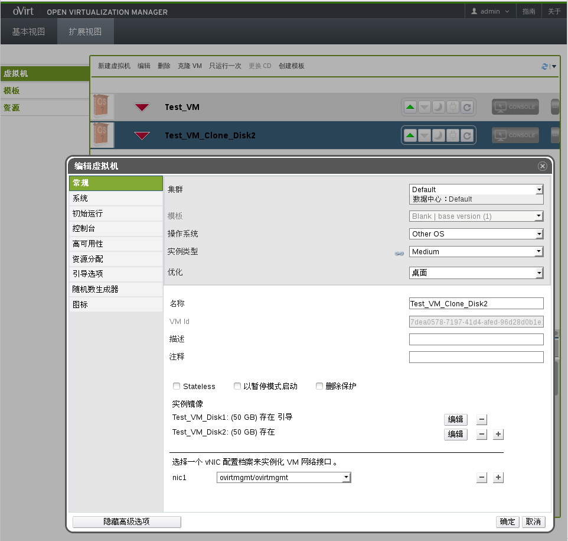

## 测试案例3

* 创建一个具有两个磁盘的虚拟机

  测试案例2中讲过如何给Test_VM虚拟机创建一个磁盘，用同样的方法给Test_VM创建两个磁盘，创建之后如图所示：

   

* 克隆这个虚拟机

  同前面的测试案例一样，点击主界面中的**克隆VM**按钮，在弹出的克隆虚拟机窗口输入克隆虚拟机的名称，点击**确定**按钮，克隆虚拟机，完成之后如图所示：

   

  可见克隆出一台名为Test_VM_Clone_Disk2的虚拟机。

* 验证此虚拟机具有两个虚拟磁盘

  选中Test_VM_Clone_Disk2虚拟机，在详情面板中点击**磁盘**标签，如图所示：

   

  可见克隆虚拟机中成功创建两个虚拟磁盘。

* 验证克隆虚拟机的所有参数都被克隆

  1.选中Test_VM虚拟机，点击**编辑**按钮，弹出编辑虚拟机窗口，显示Test_VM虚拟机参数信息，如下图所示：

   

  2.选中Test_VM_Clone_Disk2虚拟机，点击**编辑**按钮，弹出编辑虚拟机窗口，显示Test_VM_Clone_Disk2虚拟机参数信息，如下图所示：

   

  3.可以看出两台虚拟机除了名称和VM Id不同，其它各标签参数都相同。
