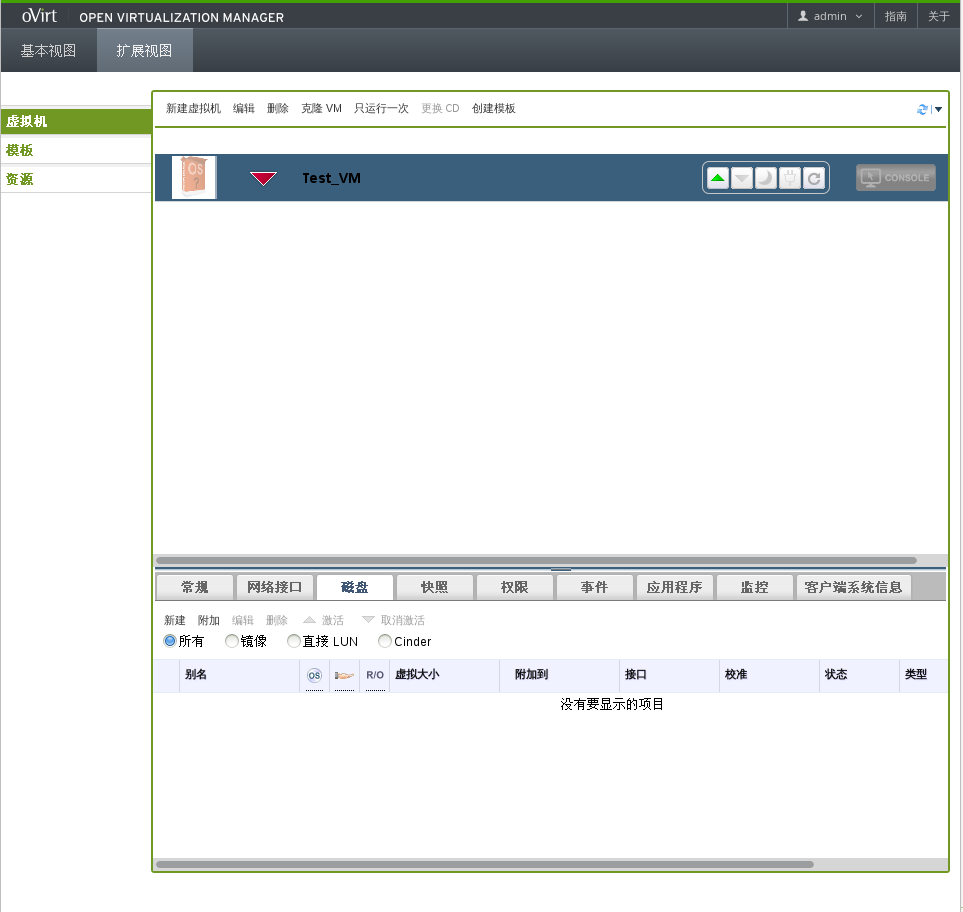
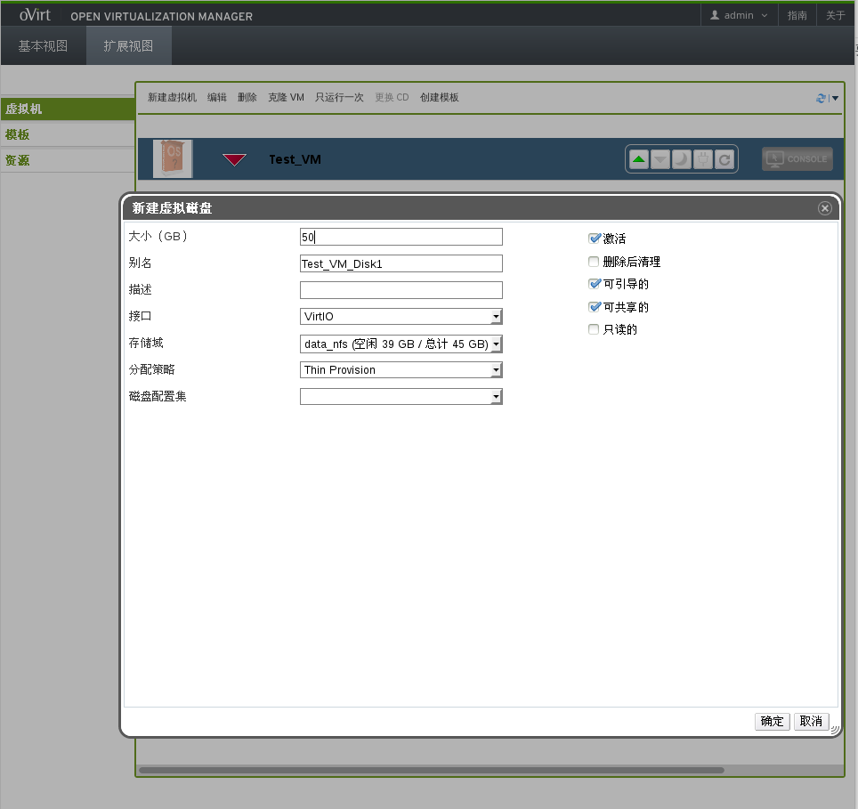
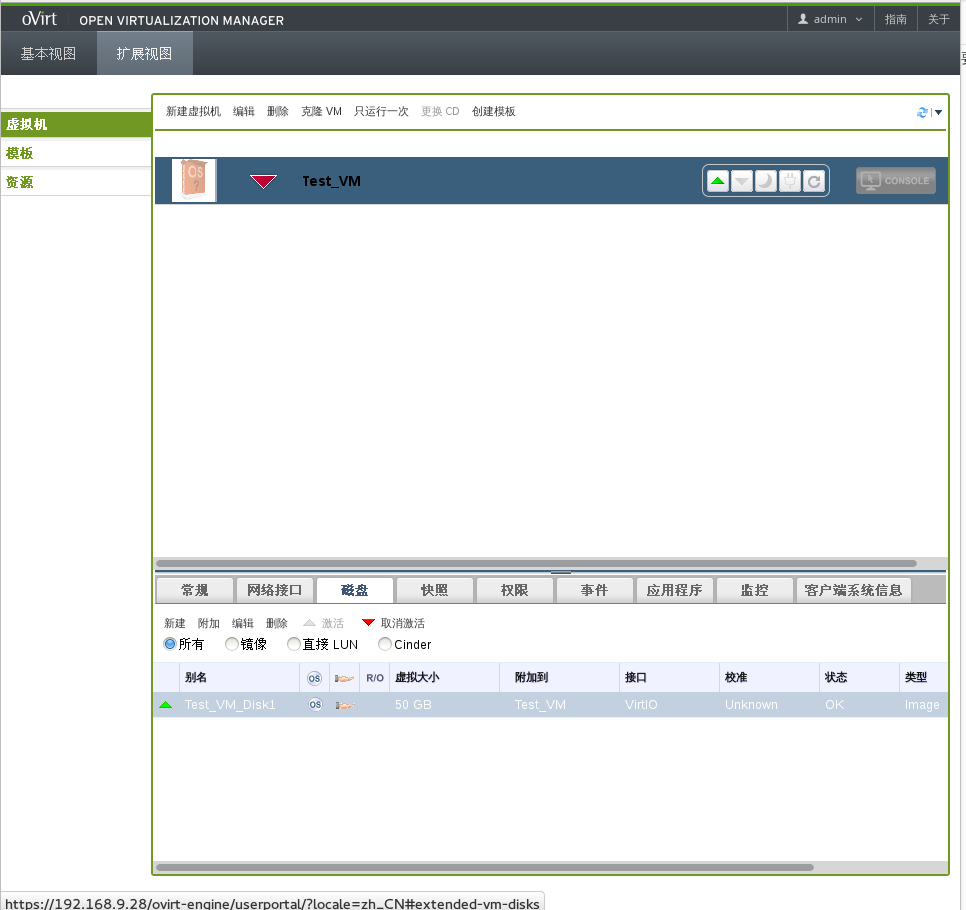
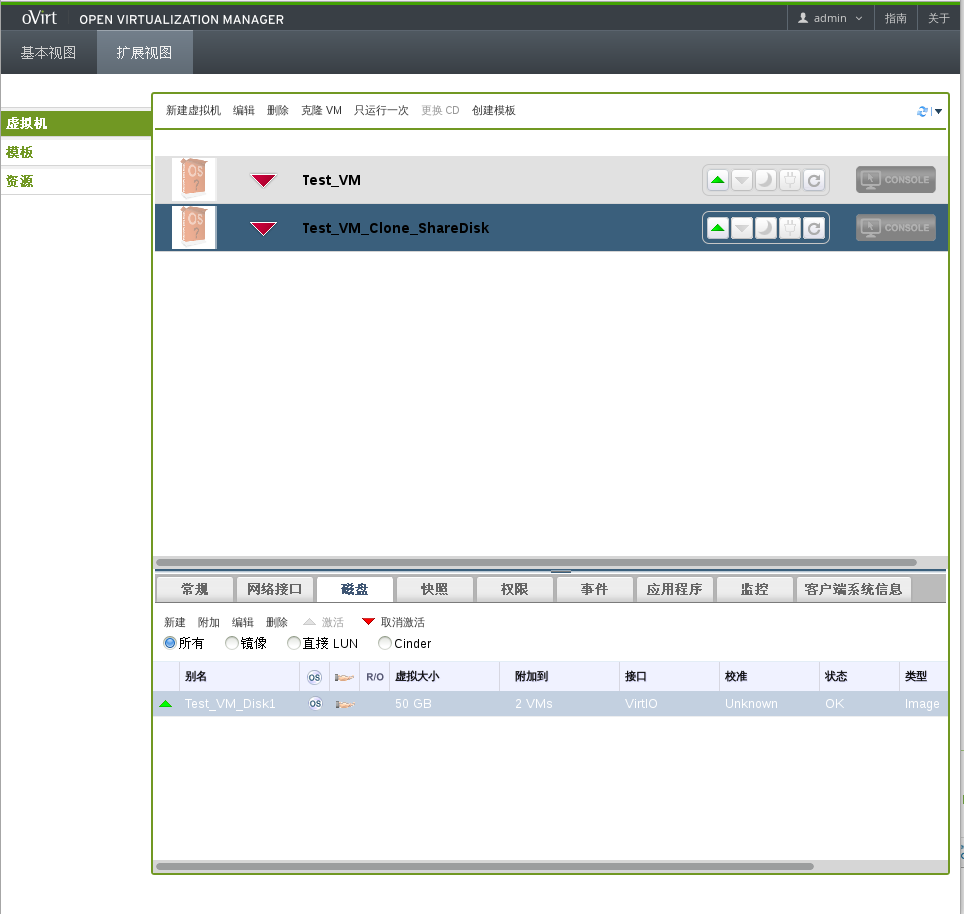
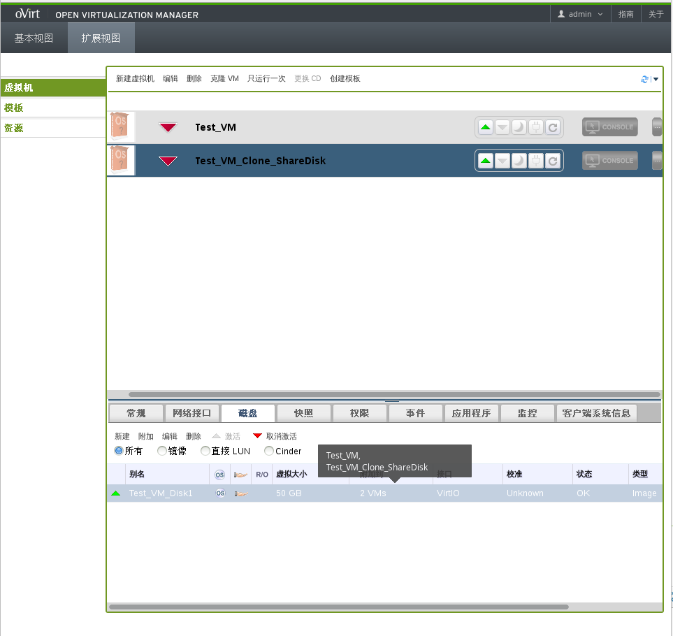

## 测试案例4

* 创建一个附加共享磁盘的虚拟机

  1.创建一台名为Test_VM没有创建任何磁盘的虚拟机，如图所示：

   

  2.在详情面板中点击**新建**按钮，弹出新建虚拟磁盘窗口，选中**可共享的**复选框，填写相应内容,如图所示：

   

  点击**确定**按钮，给虚拟机附加共享磁盘，结果如图所示：

   

* 克隆这台虚拟机

  同以上测试相同，点击**克隆VM**按钮，弹出克隆虚拟机窗口，输入要克隆虚拟机的名称，点击**确定**按钮，结果如图所示：

   

* 验证共享磁盘也附加到克隆虚拟机中

  选中Test_VM_Clone_ShareDisk虚拟机，选择**磁盘**标签，可以看到磁盘附加到两台虚拟机上，如图所示：

   

