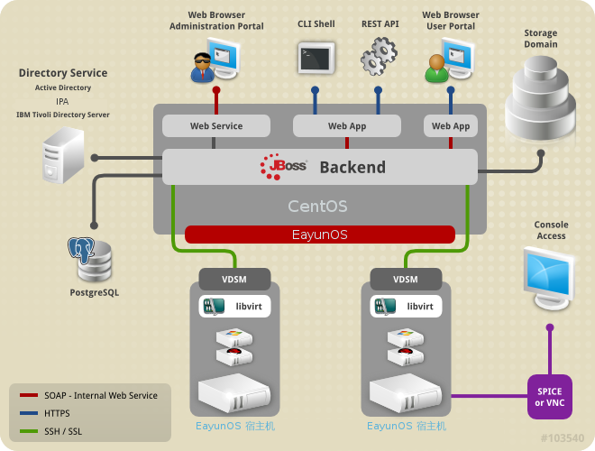

# EayunOS 架构

EayunOS 企业级虚拟化环境包括：

-   **主机**：利用 KVM 来提供虚拟化的功能，以便在主机上运行虚拟机。

-   **代理程序和工具程序**：运行在主机上的代理和工具程序（包括 VDSM，QEMU 和 libvirt）。这些工具提供了对虚拟机，网络以及存储的本地管理功能。

-   **EayunOS 企业级虚拟化管理中心**：一个对 EayunOS 企业级虚拟化环境进行集中管理的平台。它提供了一个图形化的管理界面，方便用户来查看，添加以及管理 EayunOS 虚拟化环境中的资源。

-   **存储域**：用来存储虚拟资源，例如虚拟机，模板和 ISO 文件。

-   **数据库**：用于跟踪记录整个环境的状态和变化。

-   **外部目录服务器**：用于提供用户账户以及相关身份验证功能的外部目录服务器。

-   **网络管理**：用于将整个虚拟环境联系在一起的网络。它包括物理网络连接(网卡)和逻辑网络。

