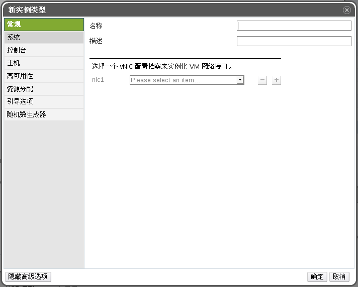

# 类型

类型定义一个虚拟机的硬件配置，当创建或者编辑虚拟机时选择一个类型，虚拟机硬件配置的字段将会自动填写该类型定义的值。用户可以用它来创建多个硬件配置想同的虚拟机，而不需要手动填写每个字段。

默认情况下有一组预定义的类型可供选择，如下表所示：

|名称|内存|虚拟CPU总数|
|----|----|-----------|
|Large|8GB|2|
|Medium|4GB|2|
|Small|2GB|1|
|Tiny|512MB|1|
|XLarge|16GB|4|

管理员可以在*配置*窗口的*类型*标签下创建、编辑、删除类型。

当新建或者编辑虚拟机时，如果窗口中的*类型*字段绑定一个特定类型，则一些属性字段左边会出现一个连接图标，如果有属性字段被更改，则左边的连接图标会显示成断开，该类型将自动与虚拟机分离。如果将更改的字段值再改回去，则恢复原先所选的*类型*连接。

##新建类型

*摘要*

管理源可以新建一个类型来供用户新建或编辑虚拟机时使用。

1.点击头部栏的*配置*按钮，打开配置窗口。

2.点击*配置*标签。

3.点击*新建*按钮，打开新建实例类型菜单。

4.在*常规*标签中填入名称和描述，其他字段可以使用默认值，也可以根据需要自主修改。

5.依次点击*系统*、*控制台*、*主机*、*高可用性*、*资源分配*、*引导选项*、*随机数生成器*等标签来定义所需类型属性。这些设置会在新建虚拟机窗口的相关字段上显示。

6.点击*确定*，新建类型，并关闭窗口。

*结果*

新建的*类型*将显示在*配置*窗口*的*类型*标签下，当创建或者编辑虚拟机时，可以在*类型*下拉菜单中选择该*类型*。
