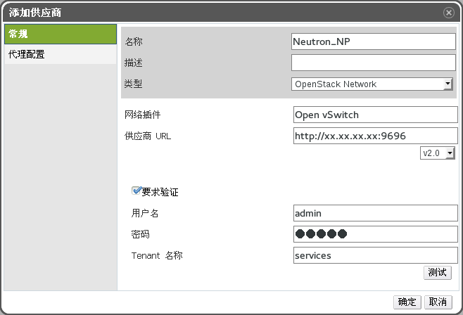
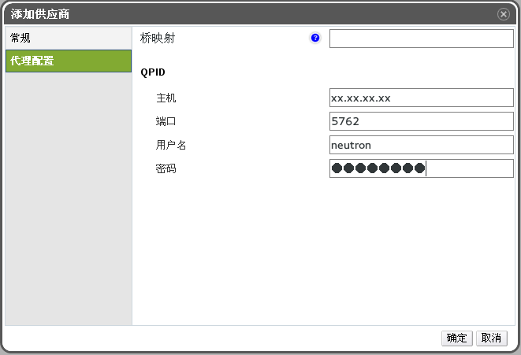

# 添加 OpenStack 网络服务( Neutron)来为系统提供网络

**概述** 
为 EayunOS 添加一个 OpenStack 网络服务(Neutron)。

**添加 OpenStack 网络服务(Neutron)来为系统提供网络**

1. 在树型框中选择**外部提供商**。

2. 点**添加**打开**添加服务商**窗口。

 

 **添加服务商窗口**

3. 输入**名称**和**描述** 。

4. 在**类型**项中选择 **OpenStack Network**。

5. 点**网络插件**的输入框,根据您的 OpenStack 环境中插件设置选择 **Linux Bridge** 或 **OpenvSwitch**。

6. 在**供应商 URL** 项中输入 OpenStack 网络服务所在机器的 URL 或全称域名(FQDN),以及它的端口号。

7. 另外,可以选择**需要验证**选项后输入 OpenStack 网络服务的**用户名** 、**密码**和**Tenant**。您必须使用与在 Keystone 中注册的 OpenStack 网络服务用户相同的用户名和密码,并且 Neutron 的 tenant**
是一个成员。

8. 测试用户身份验证信息:

  1. 点**测试**按钮来测试您所使用的验证信息是否有效。

  2. 如果 Neutron 使用SSL,**导入供应商证书**窗口会出现。点**确定**导入 Neutron 提供的证书。
  >**重要**
  >
  >在导入 Neutron 所提供的证书后,Manager 才可以和它进行通信。

9. 点**代理配置**标签页。

 

 **代理配置标签页**

10. 在**主机**项中输入 QPID 服务器所在的 URL 或全称域名(FQDN)。

11. 输入被用来连接到 QPID 的端口号,它的默认值是 5762。端口 5762 没有使用 SSL,如需使用SSL,把端口设置为 5761。

12. 输入在 QPID 中注册的 OpenStack 网络服务用户的**用户名**和**密码** 。

13. 点**确定** 。

**结果** 
您为 EayunOS 添加了 OpenStack 网络服务,并可以使用 OpenStack 网络服务所提供的网络。
