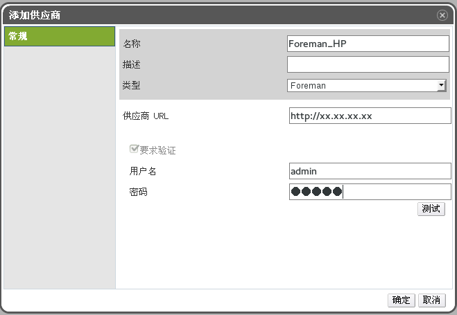

## 添加一个外部供应商

为了在您的 EayunOS 环境中使用外部供应商所提供的资源,您需要先把外部供应商添加到您的虚拟化环境中。

## 添加一个 Foreman 服务(提供主机)

### 介绍

为 EayunOS 添加一个 Foreman 服务。

### 添加一个 Foreman 服务(提供主机)

1. 在树型框中选择外部提供商 。

2. 点添加打开添加服务商窗口。

3. 输入名称和描述 。

4. 在类型项中选 Foreman。

5. 在供应商URL项中输入 Foreman 所在机器的 URL 或全称域名(FQDN)。您不需要指定端口号。

6. 为 Foreman 输入用户名和密码。您在这里必须使用和登录到 Foreman provisioning portal 相同的用户名和密码。

7. 测试用户身份验证信息:

  1. 点测试 按钮来测试您所使用的验证信息是否有效。

  2. 如果 Foreman 使用SSL,导入供应商证书窗口会出现。点确定导入 Foreman 提供的证书。
  >**重要**
  >
  >在导入 Foreman 所提供的证书后,EayunOS 才可以和它进行通信。

8. 点确定 。

### 结果

您为 EayunOS 添加了 Foreman 服务,并可以使用 Foreman 所提供的主机。

## 添加 OpenStack 网络服务( Neutron)来为系统提供网络

### 介绍

为 EayunOS 添加一个 OpenStack 网络服务(Neutron)。

### 添加 OpenStack 网络服务(Neutron)来为系统提供网络

1. 在树型框中选择外部提供商。

2. 点添加打开添加服务商窗口。

3. 输入名称和描述 。

4. 在类型项中选择 OpenStack Network。

5. 点网络插件的输入框,根据您的 OpenStack 环境中插件设置选择 Linux Bridge 或 OpenvSwitch。

6. 在供应商 URL 项中输入 OpenStack 网络服务所在机器的 URL 或全称域名(FQDN),以及它的端口号。

7. 另外,可以选择需要验证选项后输入 OpenStack 网络服务的用户名 、密码和Tenant。您必须使用与在 Keystone 中注册的 OpenStack 网络服务用户相同的用户名和密码,并且 Neutron 的 tenant
是一个成员。

8. 测试用户身份验证信息:

  1. 点测试按钮来测试您所使用的验证信息是否有效。

  2. 如果 Neutron 使用SSL,导入供应商证书窗口会出现。点确定导入 Neutron 提供的证书。
  >**重要**
  >
  >在导入 Neutron 所提供的证书后,Manager 才可以和它进行通信。

9. 点代理配置标签页。

10. 在主机项中输入 QPID 服务器所在的 URL 或全称域名(FQDN)。

11. 输入被用来连接到 QPID 的端口号,它的默认值是 5762。端口 5762 没有使用 SSL,如需使用SSL,把端口设置为 5761。

12. 输入在 QPID 中注册的 OpenStack 网络服务用户的用户名和密码 。

13. 点确定 。

### 结果

您为 EayunOS 添加了 OpenStack 网络服务,并可以使用 OpenStack 网络服务所提供的网络。

## 添加一个 OpenStack映像服务 (Glance)

### 介绍

为 EayunOS 添加一个 OpenStack 映像服务(Glance)。

### 添加一个OpenStack映像服务(Glance)

1. 在树型框中选择外部提供商。

2. 点添加打开添加服务商窗口。

3. 输入名称和描述。

4. 在类型项中选择 OpenStack Image。

5. 在供应商 URL 项中输入 Glance 所在机器的 URL 或全称域名(FQDN)。

6. 另外,可以选择需要验证后输入 Glance 的用户名 、密码和Tenant名。您必须使用与在 Keystone 中注册的 Glance 用户相同的用户名和密码,并且 Glance 的 tenant 是一个成员。

7. 测试用户身份验证信息:

  1. 点测试按钮来测试您所使用的验证信息是否有效。

  2. 如果 Glance 使用 SSL,导入供应商证书窗口会出现。点确定导入 Glance 提供的证书。
  >**重要**
  >
  >在导入 Glance 所提供的证书后,EayunOS 才可以和它进行通信。

8. 点确定。

### 结果

您为 EayunOS 添加了 Glance 服务,并可以使用 Glance 所提供的映像。

## 添加供应商的常规设置介绍

您可以在添加供应商窗口中的常规标签页中设置供应商的基本信息。

### 添加供应商:常规设置

|设置|解释|
|----|----|
|**名称**|在 EayunOS 中代表这个供应商的名称。|
|**描述**|供应商的描述信息。|
|**类型**|供应商的类型。选择不同的供应商类型会使下面的设置有所不同。 **Foreman** - **供应商 URL**:服务商所在机器的 URL 或全称域名(FQD N)。您不需要在它的后面加端口号。 - **要求验证**:指定是否需要验证供应商。当选择**Foreman**做为供应商类型时,必须要进行验证。 - **用户名**:连接到 Foreman 的用户名。这个用户名必须和登录到 Foreman 上的 provisioning 门户的用户名相同。在默认的情况下,这个用户名为**admin**。 **OpenStack 映像** - **供应商 URL**:OpenStack 映像服务所在的机器的 URL 或全称域名(FQDN)。您需要在它的后面加端口号。默认的端口号是 9292。 - **要求验证**:指定是否在访问 OpenStack 映像服务的时候需要验证。 - **用户名**:连接到 OpenStack 映像服务的用户的用户名。这个用户必须是这个 OpenStack 映像服务在 Keystone 中注册的用户。默认的用户名是 **glance**。 - **密码**: 以上用户验证所使用的密码。它必须是这个OpenStack 映像服务在 Keystone 中注册的用户的密码。 - **Tenant Name**:OpenStack 映像服务所在的tenant 的名称。它的默认值是**Services**。 **OpenStack 网络** - **网络插件** :连接到 OpenStack 服务器的网络插件。您必须根据所使用的 OpenStack 环境中的设置选择 Linux Bridge 或 Open vSwitch。 - **供应商 URL** :OpenStack 网络服务所在的机器的 URL 或全称域名(FQDN)。您需要在它的后面加端口号。默认的端口号是 9696。 - **用户名** :连接到 OpenStack 网络服务的用户的用户名。这个用户必须是这个 OpenStack 网络服务在 Keystone 中注册的用户。默认的用户名是 neutron。 - **密码** : 以上用户验证所使用的密码。它必须是这个OpenStack 网络服务在 Keystone 中注册的用户的密码。 - **Tenant Name** :OpenStack 网络服务所在的tenant 的名称。它的默认值是**Services*。|
|**测试**|测试用户所提供的验证信息。这个按钮对所有类型的供应商都有效。|

## 添加供应商代理配置中的设置介绍

添加供应商窗口中的代理配置标签页可以被用来注册与网络插件相关的信息。这个标签页只对类型为OpenStack网络的供应商有效,并且只在网络插件项中指定了网络插件后才有效。

### 添加服务商:常规设置

|设置|介绍|
|----|----|
|**接口映射**|一个以逗号分隔的端口映射列表,它的格式为label:interface。|
|**主机**|QPID所在系统的 URL 或全称域名(FQDN)。|
|**端口**|和以上主机连接的远端端口。它的默认端口是5762(没有使用 SSL),或 5761(使用 SSL)。|
|**用户名**|OpenStack 网络服务和 QPID 进行验证所使用的用户名。它的默认用户名是 neutron。|
|**密码**|使用以上用户进行验证所需要的密码。|

