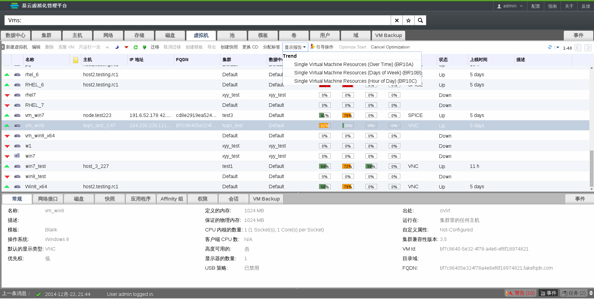

# 右键单击报表

管理员门户提供了对大多数资源报告的集成访问。

选择管理员门户中的资源来访问已有资源的报表。右键单击资源来显示一个与上下文相关的菜单，并选择 **Show Report** 选项。这个扩展可以显示出所有已选资源上的可用报表。

**右键单击报表**

另外，你可以在管理员门户中选择一个已有资源。如果这个资源恰好有报表的话，在结果列表上 **Show Report** 按显示为可用。

