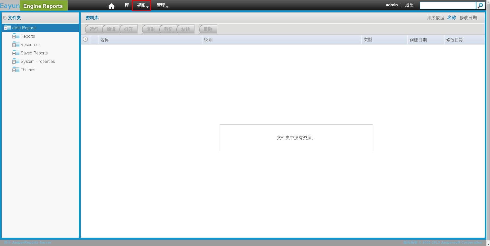
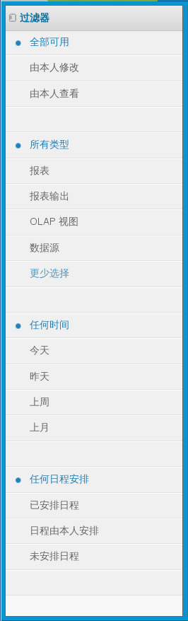

# 导航到报表
在报表门户的首页面中，选择**视图**

**图 22.5. EayunOS 企业级虚拟化报表首页界面**

你可以通过报表门户顶端的导航到**Home**()按钮，单击它可以返回到首页面。
使用界面左侧的**过滤器**窗格来选择你想看的一个子集的报告。

**图 22.6. EayunOS企业级虚拟化报表的过滤器窗格**

你可以通过使用过滤器选择想看的报表。

**表 22.1. 导航过滤器**

| 过滤器 | 描述 |
| -- | -- |
| 可用资源 | 挑选出所有由我修改过的，查看过的报表。 |
| 资源类型 | 从可用资源包括报表，临时报表，仪表盘和更多资源中选择类型 |
| 时间段 | 选择你想要看哪天的信息 |
| 计划 | 通过数据收集计划过滤 |
