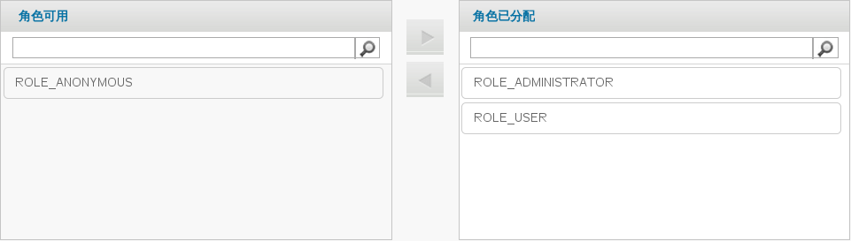

# 报表门户中的用户角色
这里一共有三个角色，每个角色都提供了不同的权限级别：
1. ROLE_ADMINISTRATOR - 能够创建/编辑/删除报表，仪表盘，临时报告并管理服务器。

2. ROLE_USER - 能够创建/编辑/删除临时报告并查看报表和仪表盘。。

3. ROLE_ANONYMOUS - 能够登录并查看报表和仪表盘。

也可以创建并分配用户角色。预知如何创建并分配其它用户，用户管理信息和其它系统功能，请参阅 JasperServer 文档。

**JasperReports 用户角色**

