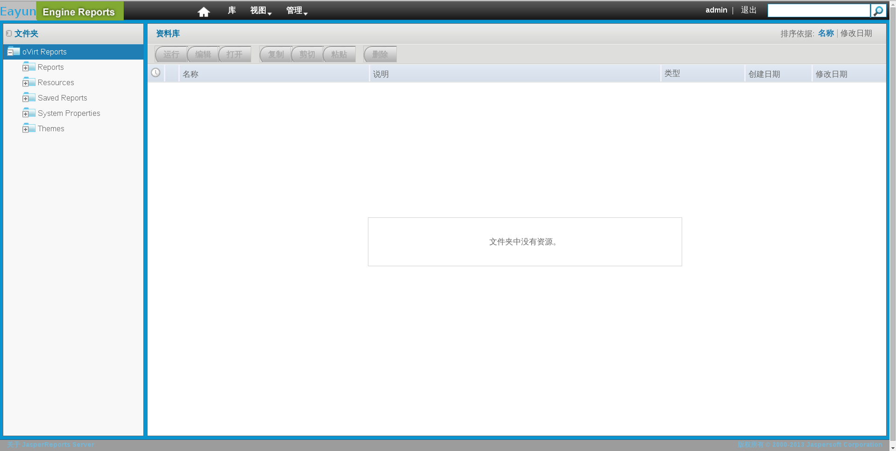

# 登录访问报表门户

如果你安装了 EayunOS 企业级虚拟化报表，你肯定根据提示设置了**superuser** 和 **admin** 的密码。EayunOS 企业级虚拟化报表没有提供默认密码。

导航倒报表门户，访问报表：
**https://YOUR.MANAGER.URL/ovirt-engine-reports/login.html**。然后，会显示出EayunOS 企业级虚拟化报表的界面。

> **注意**
>
> 你还可以从 EayunOS 的登录界面中访问报表门户。

**EayunOS 企业级虚拟化登录界面**
输入你的认证信息。如果这是你第一次登录报表门户的话，请以 **ovirt-user** 来登录。然后单击 **Login** 按钮。

**EayunOS 企业级虚拟化**
报表门户没有使用目录服务器进行身份验证。默认情况下，报表门户包含两个用户：**admin** 和 **superuser**。一般来说，额外的用户必须在报表门户中添加。

