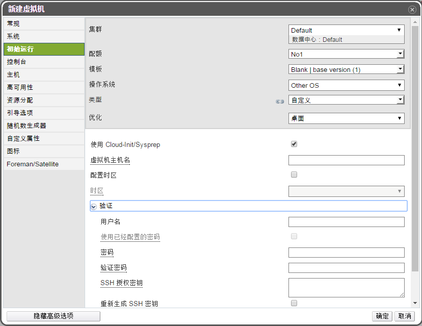

Cloud-init对Linux系统进行初始设置

**概述**
Cloud-init是专为云环境中虚拟机的Linux系统初始化而开发的工具，它对虚拟机进行云配置，配置的数据包括：虚拟机主机名、配置时区、云用户名和密码、SSH密钥、DNS服务器等。

1. 新建一个Linux系统的虚拟机，在左边导航栏选择初始运行，在中间勾选使用Cloud-Init/Sysprep。

 

2. 按提示输入相关的信息。

3. 虚拟机创建好后就可以开始安装Linux系统，等系统安装好后就会具备Cloud-Init配置的信息，例如可以用配置的用户名和密码登录系统。

