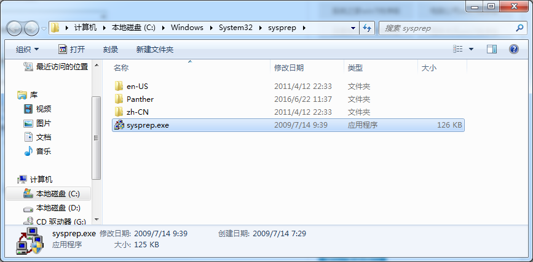
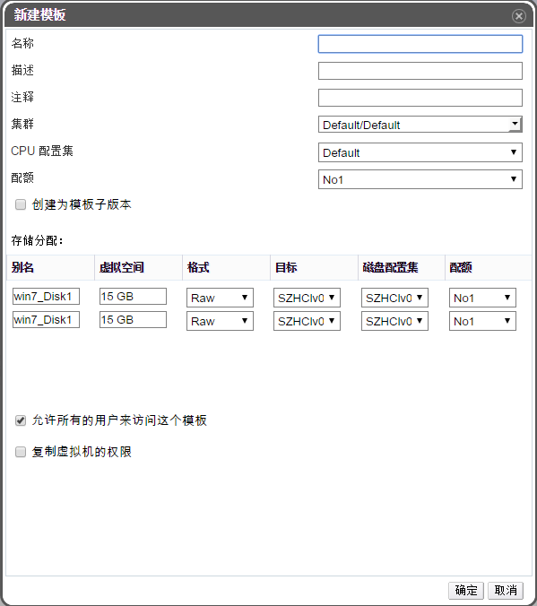
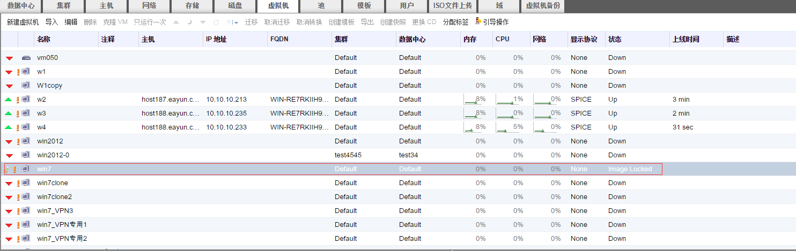
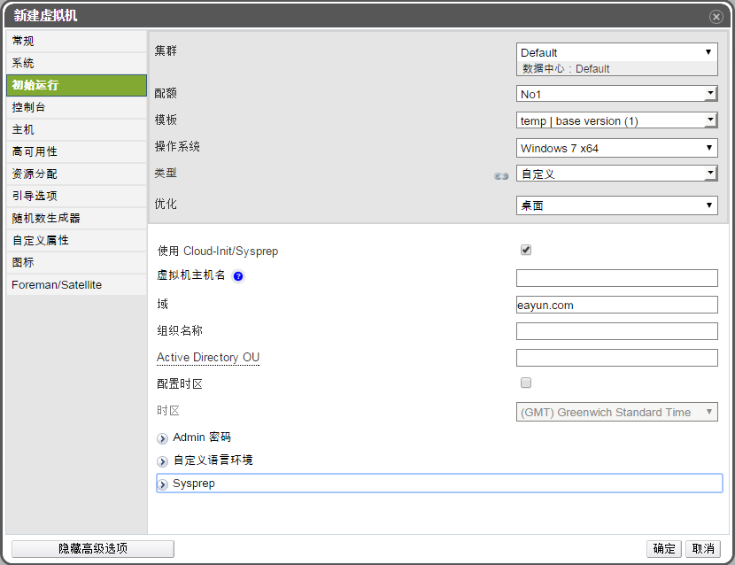
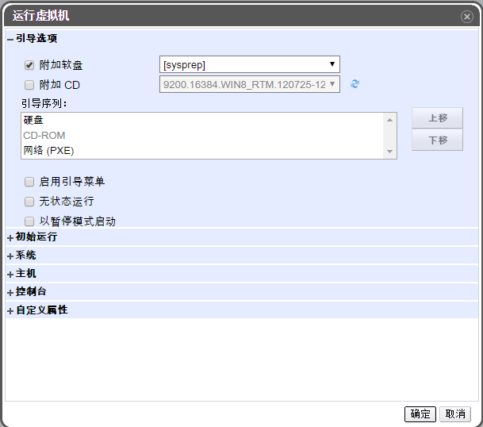

Sysprep对Windows系统进行初始设置

**概述**
Sysprep工具为 Windows （vista和7）的安装准备复制、审核和客户交付功能。使用复制（也称为映像）可以捕获可在整个组织中重复使用的自定义 Windows 映像。

1. 以Win7为例，在系统安装好后，并安装好驱动以及软件后，按WIN+R组合键打开运行窗口，在窗口中输入sysprep命令按回车，打开sysprep文件夹。

 

2. 打开的sysprep文件夹窗口中双击sysprep.exe程序。

3. 弹出系统准备工具窗口，在系统清理操作中选择 “进入系统全新体验（OOBE）”，在下方的“通用”前面打勾， 在关机选项中选择“关机”，点击“确定”按钮。

 

4. 等Win7系统成功关闭后，在EayunOS界面上选择虚拟机列表页，选中刚才那个虚拟机，右键点击“创建模板”，输入相应的信息后点击“确定”按钮。

 

5. 此时该虚拟机的状态为"Image Locked"，如图所示。

 

6. 等该虚拟机的状态为“Down”时，切换到“模板”页签，选中创建的那个虚拟机模板，右键点击“新建虚拟机”，在弹出的新建虚拟机窗口里，在左边导航栏选择“初始运行”，在中间部分勾选“使用Cloud-init/Sysprep”，输入相关的信息，例如“虚拟主机名”、“Admin密码”等信息，点击“确定”按钮。

 

7. 切换到虚拟机页签，选中刚刚创建好的虚拟机，点击“只运行一次”。

8. 在弹出的窗口里，展开“引导选项”导航，勾选“附加软盘”，在右边下拉列表里选择sysprep。点击“确定”按钮。

 

9. 此时该虚拟机会以第1步骤的虚拟机的系统信息为基础，再创建一个相同的windows系统。

10. 该虚拟机的系统初始化完毕后，就可以使用在Sysprep配置的用户名密码登录windows系统了。
