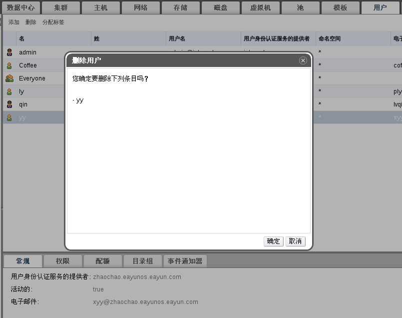

# 删除用户

**概述** 
当一个用户账户不再被需要时，从 EayunOS 中将其删除。

**删除用户**

1. 点击**用户**标签列出已被授权的用户。

2. 选择将被删除的用户。确保该用户没有运行任何虚拟机。

3. 点击**删除**按钮。将会弹出确认对话框要求您确认删除。点击**确定**。

 

 **删除用户窗口**

**结果** 
该用户从 EayunOS 中删除，但未从外部的目录服务中删除。

