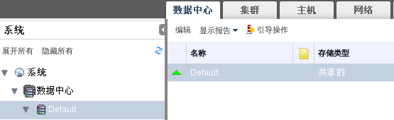
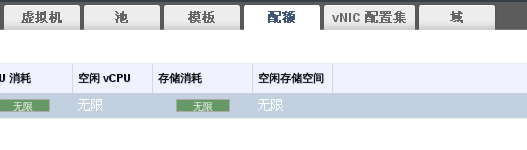
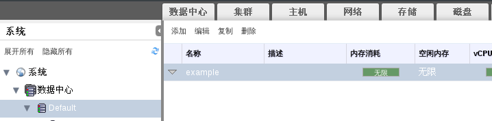

# 编辑配额

**概述** 
此过程展现如何更改已存在的配额。

1. 在树形面板中选择您想要编辑配额的数据中心。

 

 **选择一个数据中心以编辑其配额**

1. 在主面板中选择*配额*标签。

 

 **在主面板中选择配额标签**

1. 点击您想要编辑的配额的名称。

 

 **选择要编辑的配额**

1. 点击**编辑**按钮。

1. **编辑配额**窗口将打开。如果有需要，请在**名称**一栏填入配额的名称。

1. 如果有需要，请在**描述**一栏中填入关于配额的描述信息。

1. 选择**所有集群**或者**特定的集群**单选框。在**内存和 CPU**
滑动条上移动**集群阈值**和**集群宽限** 滑动块到期望的位置。

1. 选择**所有存储域**或者**特定的存储域**单选框。在**存储**滑动条上移动**存储阈值**和**存储宽限** 滑动块到期望的位置。

1. 在**编辑配额**窗口中点击**确定**按钮确认新的配额设置。

**结果** 
您成功地更新了已存在的配额。

