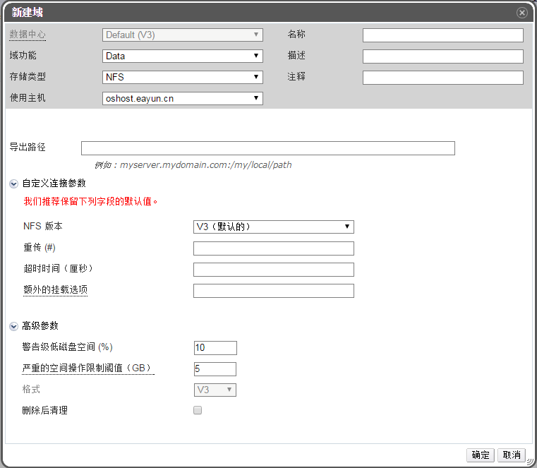

# 添加 NFS 存储

**概述** 
NFS 存储域可以用来存放虚拟机镜像文件、ISO 文件或者用来作为导出域。

**添加 NFS 存储**

1. 在 EayunOS 管理界面中打开**存储**标签列出已存在的存储域。

2. 点击**新建域**按钮打开**新建域**窗口。

   

   **添加 NFS 存储**

3. 输入存储域的**名称**（比如 test-nfs）。

4. 从下拉菜单中选择**数据中心**、**域功能/存储类型**和**使用主机**。

5. 如果可用，使用下拉菜单选择适当的**格式**。

6. 最后，在**导出路径**中填写 NFS 服务器的完整路径，比如
192.168.2.69:/home/data，然后点击确定，一段时间之后，你会看见我们新建的存储域已经在存储列表里面了

7. 另外，您还可以配置高级参数。

    * **点高级参数**。

    * 在**警告级低存储空间**项中输入一个百分比值。当存储域中的空闲空间低于这个值时，用户登录时就会显示一个警告信息。

    * 在**严重的空间操作限制阈值**项中输入一个值（以 GB 为单位）。当存储域中的空闲空间低于这个值时，用户登录时会显示一个错误信息，任何需要使用存储空间的操作（包括临时使用存储空间的操作）都会被限制。

    * 如果需要在删除虚拟磁盘后清除它上面的敏感数据，选择**删除后清除**选项。在域创建后，这个选项还可以被修改，但这不会改变已存在的、带有这个选项的存储的行为。

8. 点**确定**。

> **重要**
>
> 与存储域的通信都通过所选择的**使用主机**而不是通过 EayunOS
> 管理中心本身。所以至少数据中心中必须有一台活动主机才能够配置存储。

 

**结果** 
新建的 NFS 存储域将会出现在**存储**标签下，其状态显示为 **Locked**。操作完成之后它将会被自动附加至数据中心。

