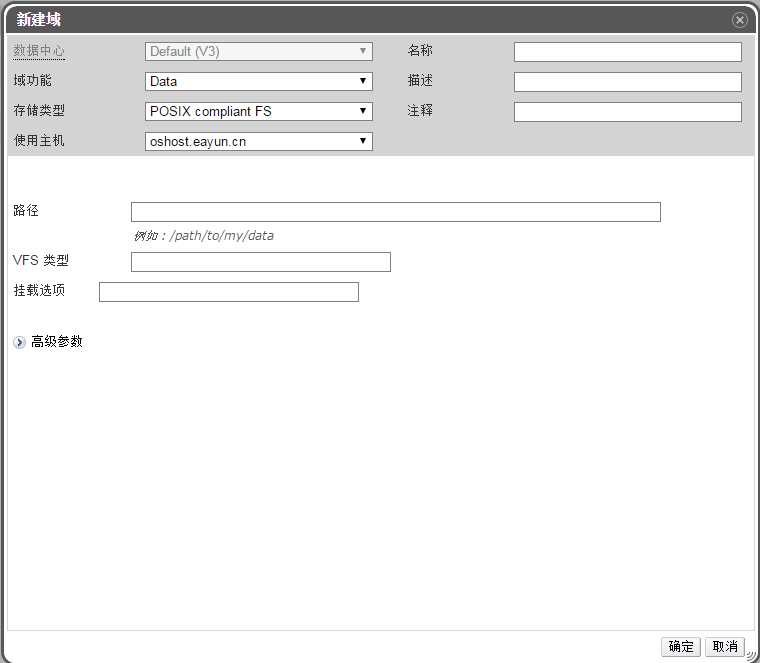

# 添加兼容 POSIX 的存储域

**概述** 
用户希望使用兼容 POSIX 的文件系统作为存储域。

**添加兼容 POSIX 的存储域**

1. 点击**存储**标签列出已存在的存储域。

2. 点击**新建域**打开**新建域**窗口，如图：

   

   **添加 POSIX 存储**

3. 输入存储域的名称，描述和注释（这两项可选）。

4. 在**数据中心**的下拉框里，选择关联的数据中心。注意该数据中心必须得是 POSIX
类型的，如果 POSIX 类型的数据中心不存在，可以暂时选择 **(none)**。

5. 从*域功能/存储域类型*下拉菜单中选择 **Data/POSIX complaint FS**。

6. 在**使用主机**下拉菜单选择适当的主机。

7. 填写 POSIX 文件系统的**路径**，和 mount 参数的路径是一致的。

8. 填写 **VFS 类型**，和 mount 的 **-t** 参数是一致的。

9. 填写**挂载选项**，和 mount 的 **-o** 参数是一致的。

10. 另外，您还可以配置高级参数。

    * 点高级参数。

    * 在警告级低存储空间项中输入一个百分比值。当存储域中的空闲空间低于这个值时，用户登录时就会显示一个警告信息。

    * 在严重的空间操作限制阈值项中输入一个值（以 GB 为单位）。当存储域中的空闲空间低于这个值时，用户登录时会显示一个错误信息，任何需要使用存储空间的操作（包括临时使用存储空间的操作）都会被限制。

    * 如果需要在删除虚拟磁盘后清除它上面的敏感数据，选择删除后清除选项。在域创建后，这个选项还可以被修改，但这不会改变已存在的、带有这个选项的存储的行为。

11. 点击确定保存设置，添加该存储到 EayunOS 系统中。

**结果** 
成功挂载了一个 POSIX 兼容的文件系统作为存储域。

