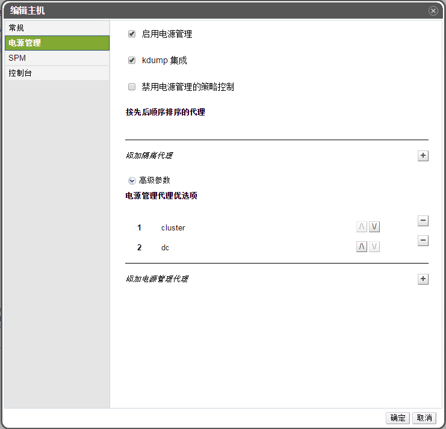
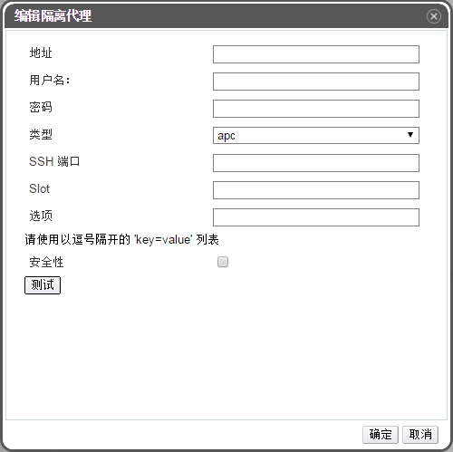

# 在主机上设置隔离的参数

主机隔离的参数使用**新建主机**或者**编辑主机**窗口中的**电源管理**标签下的项目来进行设置。电源管理允许系统通过使用例如远程接入卡(RAC)之类的额外接口隔离一台出问题的机器。

所有电源管理相关的操作是通过一台代理的主机完成的，而不是由 EayunOS 虚拟化管理中心本身完成。因此要完成电源管理相关的操作，至少需要两台主机。

**在主机上设置隔离参数**

1. 使用**主机**标签、树形面板或者搜索功能查找并在主面板中选择主机。

2. 点击**编辑**按钮，打开**编辑主机**窗口。

3. 点击**电源管理**子标签。

   

   **电源管理设置**

4. 勾选**启用电源管理**激活窗口中的选项。

5. 如果不希望主机所在集群的**调度策略**控制主机的电源管理，则选择**禁用电源管理的策略控制**。

6. 点加号（+）按钮来添加新的电源管理设备。**编辑隔离代理**窗口会被打开。

   

7. 在相关的项中输入电源管理设备的**地址**、**用户名**和**密码**。

8. 从下拉列表中选择电源管理设备的**类型**。

9. 输入电源管理设备用来和主机进行交流所使用的 **SSH 端口号**。

10. 输入用来识别电源管理设备刀片的 **Slot** 号。

11. 为电源管理设备输入**选项**。使用逗号分隔多个选项，选项的格式是 'key=value'。

12. 选择**安全性**选择框来使电源管理设备通过安全的方法和主机进行交流

13. 点**测试**来测试电源管理设备。如果测试成功，Test Succeeded, Host Status is: on
将会被显示。

   > **警告**
   >
   > 电源管理的参数（用户名、密码、选项等）只在设置和您手 动要求时 EayunOS Manager 才会进行测试。如果您选择忽略不正确参数的警告，或者电源管理硬件上的参数被更改而EayunOS Manager上没有做相应的更改，隔离操作将很有可能在最需要的失效。

14. 点**确定**关闭**编辑隔离代理**窗口。

15. 在**电源管理**标签页中，还可以展开**高级参数**项，使用向上或向下按钮来指定 Manager 搜索主机的**集群**和**dc**（datacenter）作为隔离代理的顺序。

16. 点确定。

**结果** 
  您将返回到主机列表的界面。您将注意到主机名前面的感叹号已经消失了，这标志着电源管理已被成功配置。

