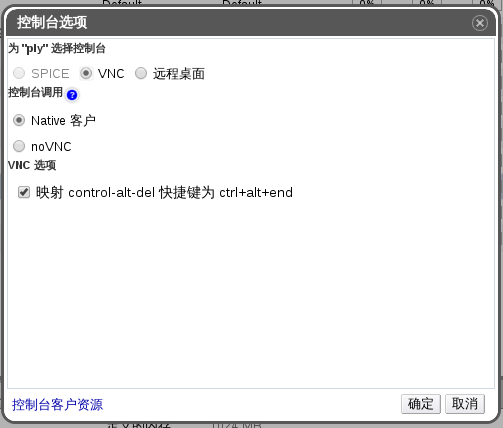

# VNC 控制台选项

当选择了 VNC 连接协议的时候，如下的选项可以在**控制台选项**窗口里设置。

**控制台选项窗口**

**控制台调用**

* **Native 客户**：当你连接虚拟机的控制台时，将会下载一个文件，并通过 Remote Viewer 打开该文件来访问虚拟机。

* **noVNC**：当你连接虚拟机的控制台时，浏览器多出一个选项卡并充当为虚拟机的控制台。

**VNC 选项**

* **映射 control-alt-del 快捷键为 ctrl+alt+end**：勾选该设置来将 **Ctrl+Alt+Del** 键位组合映射到虚拟机内的 **Ctrl+Alt+End** 键位组合。

