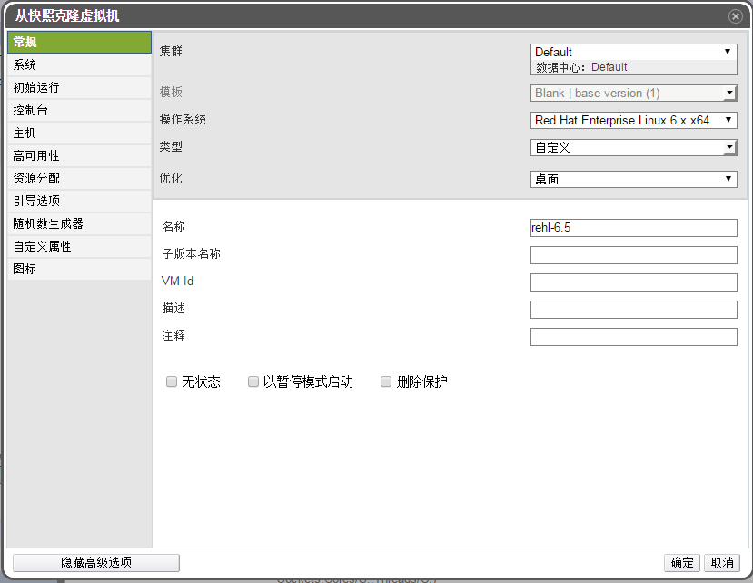

# 从快照中创建虚拟机

**介绍** 
如果您为一个虚拟机创建了一个快照，您可以使用这个快照来创建其它虚拟机。

**通过快照创建一个虚拟机**

1. 选**虚拟机**标签页并选择一个虚拟机。

2. 在详情框中点**快照**标签页列出有效的快照。

3. 选择一个快照，点**克隆**打开**从快照克隆虚拟机**窗口。

4. 为需要创建的虚拟机输入**名称**和**描述**。

   

   **从快照克隆虚拟机**

5. 点**确定**创建虚拟机并关闭窗口。

**结果** 
克隆的虚拟机出现在**虚拟机**标签页中，它的状态为 **Image Locked**。这个虚拟机会一直维持这个状态，直到 EayunOS 完成了整个虚拟机创建过程。一个带有类型为 preallocated 的 20GB 硬盘的虚拟机需要大约 15 分钟来创建。创建使用类型为 Thin Provision 的虚拟磁盘的虚拟机所用的时间会短一些。

当虚拟机在虚拟机标签页中的状态从 **Image Locked** 变为 **Down** 后，它将可以被使用。
