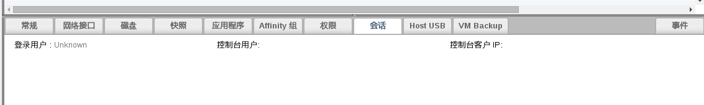

# 使用会话标签页来监测虚拟机的登录情况

连接到 EayunOS 虚拟化平台中虚拟机的客户端在有的时候需要进行维护或升级。您可以通过会话来监测虚拟机的登录情况，从而可以避免在那些正在被使用的系统上进行维护操作。

**虚拟机会话标签页**

使用**虚拟机**资源标签页、树形模式或搜索功能找到并选择一个虚拟机。在详情框中选择**会话**标签页来显示**登录用户**、**控制台用户**和**控制台客户 IP** 信息。
