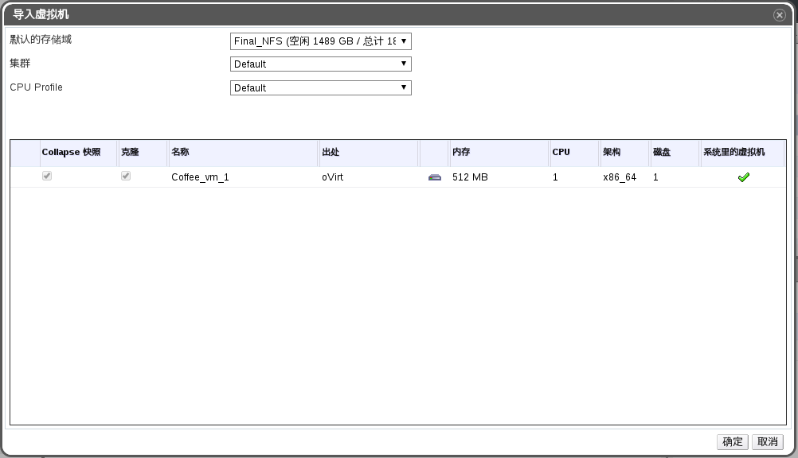
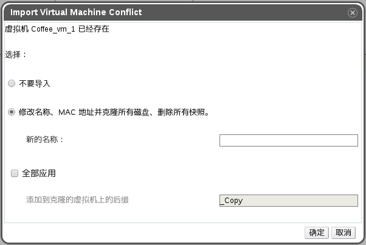

# 导入虚拟机到目标数据中心

**介绍** 
您已经把虚拟机导出到导出域。在这个虚拟机可以被导入到新的数据中心前，导出域必须被添加到目标数据中心上。

**把虚拟机导入到目标数据中心**

1. 使用**存储**资源页、树形模式或搜索功能来找到并选择导出域。导出域的状态必须是活跃。

2. 在详情框中点**虚拟机导入**标签页列出所有要导入的虚拟机。

3. 选一个或多个需要导入的虚拟机，点**导入**打开**导入虚拟机**窗口。

   

   **导入虚拟机**

4. 使用下拉菜单选择**默认存储域**和**集群**。

5. 选择 **Collapse 快照**来删除快照的恢复点，并包括虚拟机所基于的模板。

6. 选择要被导入的虚拟机后点**磁盘**子标签页。您可以通过选择这个标签页中的**分配协议**和**存储域**下拉列表指定这个虚拟机要使用的磁盘类型是 thin provision 或是 preallocated，以及磁盘所在的存储域。另外，一个特殊的图标被用来标识哪一个被导入的磁盘将被作为虚拟机的引导磁盘。

7. 点确定导入虚拟机。

   如果虚拟机己经在虚拟环境中存在了，**导入冲突**窗口会被打开。

   

   **导入冲突窗口**

8. 选择以下选项之一：

   * 不导入
   * **克隆**并在**新名字**项中为这个虚拟机输入一个不同的值。

   或选择**全部应用**来导入所有重复的虚拟机（这些导入的虚拟机会被加一个相同的后缀）。
9. 点**确定**导入虚拟机并关闭窗口。

> **重要**
>
> 在进行一个导入操作时，您只能导入具有相同架构的虚拟机。如果在您选择导入的虚拟机中有和其它虚拟机架构不同的虚拟机，系统将会显示一个警告信息来要求您修改您的选择。

**结果** 
您在目标数据中心中导入了虚拟机。这个操作可能会需要一些时间才能完成。
