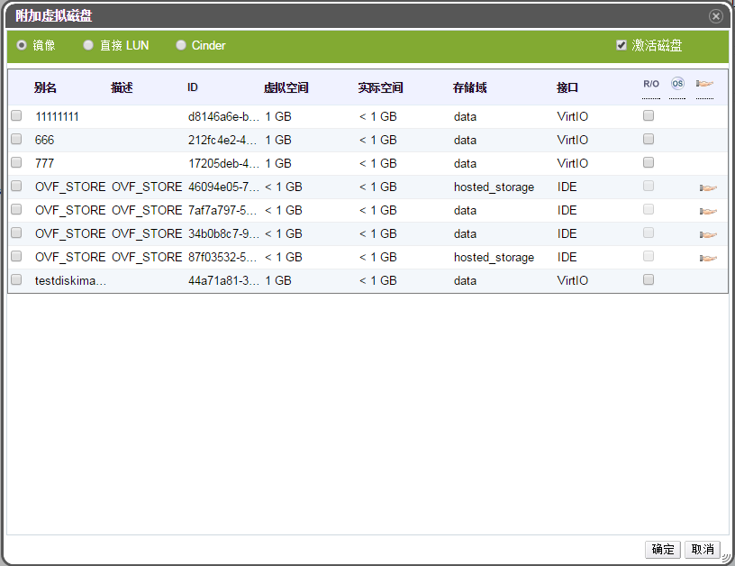

# 新建、附加和编辑虚拟磁盘

**概述** 
EayunOS 虚拟化管理中心允许用户给虚拟机添加新的磁盘。用户可以给虚拟机添加新的
磁盘，或者把之前创建的浮动磁盘分配给虚拟机。用户也可以创建虚拟机之间可以
共享的磁盘。或者编辑磁盘的属性。

默认情况下，创建的磁盘类型是内部磁盘。用户也可以增加**直接 LUN**和**Cinder**磁盘。 内部磁盘被 EayunOS 虚拟化管理中心管理。用户要使用**直接 LUN**或**Cinder**磁盘，必须先把该磁盘（LUN/Cinder） 的 target 增加到系统里。创建的磁盘可以是共享的，或者是浮动的。

**添加虚拟磁盘到虚拟机**

1. 点击**虚拟机**标签列出系统中的所有虚拟机，找到需要连接 的虚拟机。

2. 在详细信息面板上，点击**磁盘**，将会显示附加到该虚拟机上的所有磁盘。

3. 点击**附加**，打开**附加虚拟磁盘**窗口。

   

   **附加虚拟磁盘窗口**

4. 使用单选按钮在**镜像**、**直接 LUN**和**Cinder**之间来选择要添加的磁盘类型。

5. 选择要添加的磁盘，并且勾选**激活**框。

   或者，输入新的虚拟磁盘的**大小**，**别名**，和**描述**信息，并且用下拉列表和勾选框来配置虚拟磁盘。

6. 点击窗口又下角的**确定**给虚拟机分配浮动磁盘，关闭弹出窗口。

**结果** 
我们已经给虚拟机分配给了新的磁盘，在虚拟机的**磁盘**子选项卡的磁盘列表上会被列出来。

