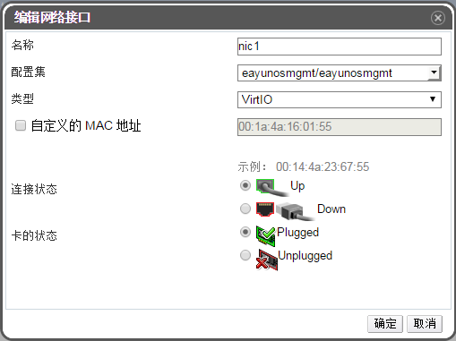

# 添加、编辑虚拟网卡

**概述** 
用户可以给虚拟机添加网络接口使得虚拟机有多块网卡。用户也编辑已经添加
的网卡，更新网卡的某些属性。下面描述的步骤可以在虚拟机运行的时候执行,
但是某些操作必须要虚拟机关机才能执行。

**向虚拟机添加虚拟网卡**

1. 点击**虚拟机**标签列出系统中的所有虚拟机，找到需要连接的虚拟机。

2. 在下面的虚拟机详细信息面板上选择**网络接口**子选项卡列出目前附加到该虚拟机下的网络接口。

3. 点击**新建**，打开**新建网络接口**窗口。

   

   **新建网络接口窗口**

4. 输入网卡的**名称**。

5. 利用下拉列表选择配置集和类型，设置网络接口的详细参数。默认状态下链路状态是Up，并且连接到了虚拟机和网络。

   > **注意**
   >
   > **配置集**列表是虚拟机所在集群中可用的配置集列表，**类型**列表是虚拟机可用的接口类型。

6. 如果想要设置 MAC 地址的话，在**自定义的 MAC 地址**处设置给虚拟机的 MAC 地址。

7. 点击确定，关闭**创建网路接口**弹出框，打开**新建虚拟机 - 引导操作**窗口。

**结果** 
我们已经给虚拟机添加了新的网络接口，在虚拟机的**网络接口**选项卡里的列表上会被列出来。
