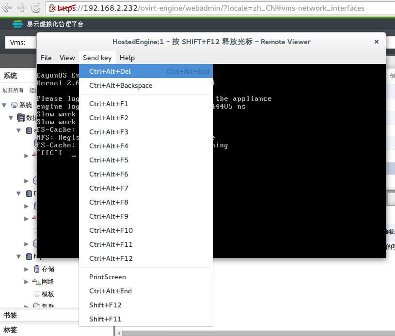

# 配置 Remote Viewer 选项

当你指定了 **Native 客户**或者**浏览器插件**的控制台调用配置的话，将会使用 Remote Viewer
连接到虚拟机。Remote Viewer 窗口提供了很多选项来与虚拟机的控制台交互。

**Remote Viewer 连接菜单**

**Remote Viewer 选项**

|选项|快捷键|
|----|------|
|File|<ul><li>**Screenshot**：对活动的 Remote Viewer 窗口截图，并保存到指定的位置。</li><li>**USB device selection**：如果 USB 重定向在虚拟机里启用了，在客户机器上插入的 USB 设备可以在该菜单看到。</li><li>**Quit**：关闭控制台，该功能的快捷键为 **Shift+Ctrl+Q**。</li></ul>|
|View|<ul><li>**Full screen**：切换全屏模式，快捷键为**SHIFT+F11**。</li><li>**Zoom**：放大或者缩小控制台窗口。使用**Ctrl**+**+**来放大，使用**Ctrl**+**-**来缩小，使用**Ctrl**+**0**来回到初始大小。</li><li>**Automatically resize**：启用自动调整虚拟机显示输出的大小为控制台窗口的大小。</li><li>**Displays**：开启或者关闭某一个虚拟机的显示输出。</li></ul>|
|Send Key|<ul><li>**Ctrl+Alt+Del**：向虚拟机发送 Ctrl+Alt+Del 组合键。</li><li>**Ctrl+Alt+Backspace**</li><li>**Ctrl+Alt+F1**</li><li>**Ctrl+Alt+F2**</li><li>**Ctrl+Alt+F3**</li><li>**Ctrl+Alt+F4**</li><li>**Ctrl+Alt+F5**</li><li>**Ctrl+Alt+F6**</li><li>**Ctrl+Alt+F7**</li><li>**Ctrl+Alt+F8**</li><li>**Ctrl+Alt+F9**</li><li>**Ctrl+Alt+F10**</li><li>**Ctrl+Alt+F11**</li><li>**Ctrl+Alt+F12**</li><li>**Printscreen**</li></ul>|
|Help|**About** 显示当前使用的 Virt Viewer 的版本信息。|
|Release Cursor from Virtual Machine|**SHIFT+F12**|
