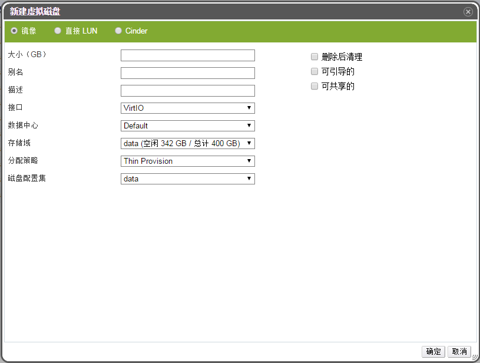

# 创建浮动磁盘

**概述** 
用户可以创建一个独立于所有虚拟机的虚拟磁盘。然后将此磁盘附加给一个或多个虚拟机。

镜像磁盘的创建完全由 Manager 管理，而直接 LUN 磁盘则需要已存在的、由外部准备好的目标设备。Cinder 磁盘需要可以访问通过外部供应商界面添加到 EayunOS 虚拟环境中的 OpenStack Volume 实例。

1. 在导航面板上点击**磁盘**标签

2. 点击导航面板左上角的**新建**按钮打开**新建虚拟磁盘**窗口。

 

 **添加虚拟磁盘窗口**

3. 选择虚拟磁盘是镜像、直接 LUN 或 Cinder 磁盘。

4. 输入虚拟磁盘的**大小（GB）**、**别名**和**描述**。

5. 在下拉菜单中选择虚拟磁盘的**接口**、**分配策略**、**数据中心**、**存储域**和**磁盘配置**。

6. 根据需要勾选**删除后清理**、**是可引导的**或者**是可共享的**选项。

7. 点击**确定**按钮创建虚拟磁盘并关闭该窗口。

**结果** 
一个虚拟磁盘已经创建好了，该磁盘可在不同的虚拟机之间共享。

