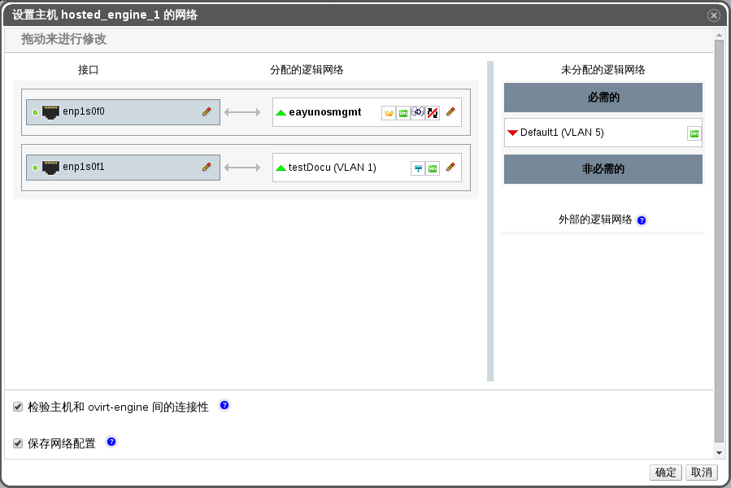

# 为使用了逻辑网络的单独的网络接口添加多个 VLAN

**概述**
多个 VLAN 可以被添加到一个网络接口上来，以分离一台主机上的网络流量。

> **重要**
>
> 您必须已经创建了多个逻辑网络，而且每个逻辑网络的**新建逻辑网络**或**编辑逻辑网络**窗口中的**启用 VLAN 标签**这个复选框必须被选中。

**将多个 VLAN 添加到使用了逻辑网络的一个网络接口上**

1. 使用**主机**资源选项卡，树形模型，或者搜索功能在结果列表中进行选择一个分配标记了 VLAN 的逻辑网络的集群中的一台主机。

2. 在详情面板中点击**网络接口**标签，列出和这个主机相关联的物理网络接口。

3. 点击**设立主机网络**，会弹出**设置主机网络**窗口。

4. 将您的已用 VLAN 标记过的逻辑网络拖拽到**接口**旁边的**分配的逻辑网络**区域内。由于启动了 VLAN 标签功能，物理网络接口可以有多个逻辑网络和它相连。

 
 **设置主机网络**

5. 将您的鼠标拖到一个已经分配了的逻辑网络上，点击铅笔图表，会弹出**编辑网络**的窗口。
   如果您的逻辑网络的定义和该主机上的网络配置不同步的话，请您选择**同步网络**这个复选框。
   选择一个**引导协议**：
   * **None**，
   * **DHCP**，
   * **Static**，
   请您输入 **IP** 和**子网掩码**。
   点击**确定**。

6. 选择**检验主机和 ovirt-engine 间的连接性**这个复选框来执行网络检查；该功能只有在主机处于维护模式下才有效。

7. 选择**保存网络配置**这个复选框。

8. 点击**确定**。

通过编辑集群中每台主机上的 NIC，来将逻辑网络添加到每台主机上。完成该操作之后，网络将会正常工作。

**结果** 
您已经成功的为一个单独的网络接口添加了多个开启了 VLAN 标签功能的逻辑网络。这个步骤可以重复多次，每次在每台主机上选择并编辑相同的网络接口，将带有不同 VLAN 标签的逻辑网络添加到一个单独的网络接口上。

