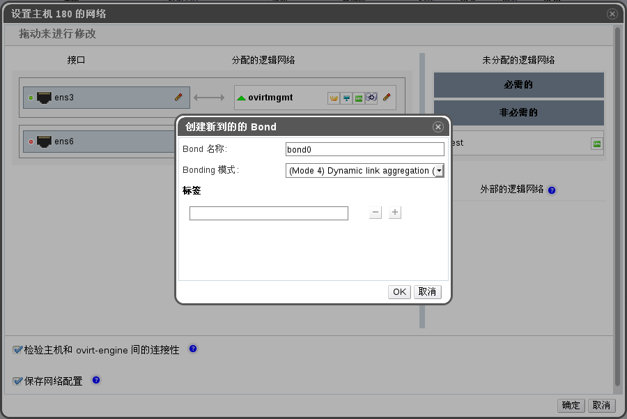

# 使用 EayunOS 管理员门户创建网卡绑定设备

**概述** 
  您可以将相互兼容的网卡设备进行绑定。这样设置能够提高可用带宽和可靠性。您可以将多块网卡设备、已存在的多个网卡绑定设备，或者以上两者的组合进行绑定。

  一个网卡绑定设备不能够同时承载启用了 VLAN 标签和未启用 VLAN 标签的流量。

**使用管理门户创建网卡绑定设备**

1. 使用**主机**标签、树形面板或者搜索功能查找并在主面板中选择主机。

1. 点击详情面板中的**网络接口**子标签以列出该主机上的网卡及它们的配置信息。

1. 点击**设立主机网络**按钮，打开**设立主机网络**窗口。

1. 选择并拖拽一个网卡设备到另一个网卡设备上方并释放，打开**创建新网卡绑定**窗口。另外您也可以通过右键点击该设备并从下拉菜单中选择另外一个设备来进行。

   如果所选择的设备相互不兼容，例如其中一个启用了 VLAN 标签而另一个没有，该操作将失败，并提示您如何解决兼容性的问题。

   

   **创建新网卡绑定窗口**

1. 从下拉菜单中选择**绑定名称**和**绑定模式**。

   绑定模式 1、2、4、5能够从下拉菜单中直接选择。其它的模式能够使用**自定义**选项进行配置。

1. 点击**确定**按钮创建绑定设备并关闭**创建新网卡绑定**窗口。

1. 分配一个逻辑网络到刚创建的网卡绑定设备。

1. 根据需要勾选**检验主机和eayun-manager间的连接性**和**保存网络配置**选项。

1. 点击**确定**接受所做的改变并关闭**设立主机网络**窗口。

**结果** 
  您的网卡设备被连接到一个网卡绑定设备中并能够作为一个单独的网络接口进行配置修改。网卡绑定设备将在所选择主机的详情面板中的**网络接口**子标签中被列出。

  您必须在交换机上与主机连接的端口同样启用网卡绑定功能。不同交换机上启用网卡绑定功能的操作过程可能会有所不同；请参考交换机厂商提供的手册获得关于如何启用网卡绑定功能的详细信息。

