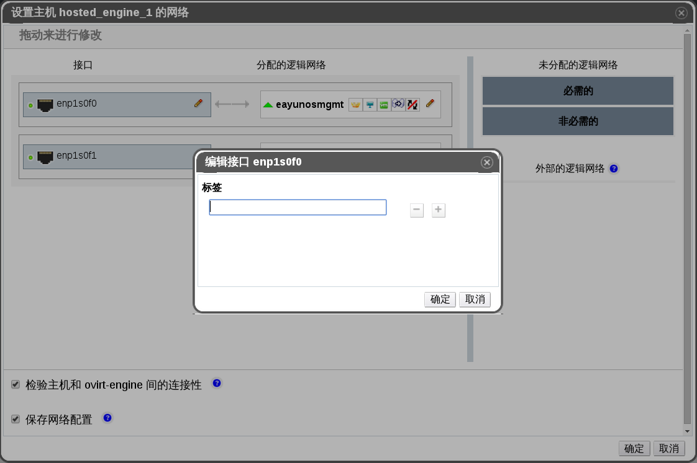

# 将网络标签添加到主机网络接口中

**概述** 
使用网络标签可以大大简化与为主机网络接口分配逻辑网络相关的管理工作。

**为主机网络接口添加网络标签**

1. 使用**主机**资源标签，树模型，或者搜索功能在结果列表上查找并选择一台主机，这台主机必需是在一个具有启用了 VLAN 标签功能的逻辑网络的集群中。

2. 在详情面板中点击**网络接口**标签，会列出该主机上的物理网络接口。

3. 点击**设立主机网络**，会弹出**设置主机网络**窗口。

4. 将鼠标悬停在一个物理主机接口之上，并点击铅笔图标，会弹出**编辑接口**的窗口，现在您可以编辑该物理网络接口。

 

 **编辑接口窗口**

5. 在**标签**文本域内输入网络标签的名称，并通过使用 **+** 和 **-** 来添加或删除其它的网络标签。

6. 点击**确定**。

**结果** 
您已经成功的为一个主机网络接口添加了一个网络标签。任何一个新创建出来的带有相同标签的逻辑网络逻辑网络会被自动分配到所有具有该标签的主机网络接口上。并且，如果从一个逻辑网络上删除一个标签，那么该逻辑网络会自动从带有那个标签的主机网络接口上消失。

