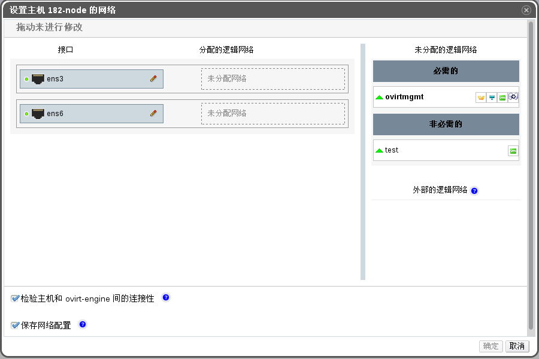

# 编辑主机网卡和添加逻辑网络到主机

**概述**<br/>
您可以修改主机上物理网卡的设置，将管理网络从一台主机的物理网络接口移动到另一台主机的物理网络接口上，并将逻辑网络分配给主机的物理网络接口。

> **重要**
>
> 您不可以将外部供应商提供的逻辑网络分配给主机的物理网络接口。这些网络会在虚拟机需要它们的时候，被动态的分配到相应的主机上。

**编辑主机网卡并给主机分配逻辑网络**

1. 使用**主机**资源标签，树形模型或者搜索功能在结果列表中查找主机，并进行选择。

1. 点击详情面板中的**网络接口**子标签以列出该主机上的网卡及它们的配置信息。

1. 点击**设立主机网络**按钮，会弹出**设置主机网络**窗口。

   

   **设立主机网络窗口**

1. 通过选择并拖拽逻辑网络到**接口**旁边的**分配的逻辑网络**区域，来将逻辑网络附加到一物理主机网络接口上。

   另外，还可以通过右键点击逻辑网络，并在下拉菜单中选择网卡。

1. 配置逻辑网络：

  1. 将您的鼠标光标置于**分配的逻辑网络**之上，点击铅笔小图标打开**编辑管理网络**窗口。

  1. 从以下内容中选择**引导协议**：

      * **None**，
      * **DHCP**，
      * **Static**。

     如果您选择了**Static**，请输入 **IP**，**子网掩码**和**网关**。

  1. 为了配置一个网桥，请您点击**自定义属性**下拉菜单，并选择**bridge_opts**。按照 [key]=[value] 语法格式输入一个合理的键值对。如果有多个健值对，用空格隔开。下面的 key 都是有效的，其值是作为实例给出的：

  ```
  forward_delay=1500 
  gc_timer=3765 
  group_addr=1:80:c2:0:0:0 
  group_fwd_mask=0x0 
  hash_elasticity=4 
  hash_max=512
  hello_time=200 
  hello_timer=70 
  max_age=2000 
  multicast_last_member_count=2 
  multicast_last_member_interval=100 
  multicast_membership_interval=26000 
  multicast_querier=0 
  multicast_querier_interval=25500 
  multicast_query_interval=13000 
  multicast_query_response_interval=1000 
  multicast_query_use_ifaddr=0 
  multicast_router=1 
  multicast_snooping=1 
  multicast_startup_query_count=2 
  multicast_startup_query_interval=3125
  ```

  1. 如果您的逻辑网络定义和主机上的网络配置不同步，请您选择**同步网络**复选框。同步后，您便可以对逻辑网络进行编辑或者将其附加到其它网卡上。

  > **注意**
  >
  > 满足以下条件之一的网络被视为没有同步：
  > 
  > * 虚拟机网络和物理主机网络不同。
  > * VLAN 标识符和物理主机网络不同。
  > * 逻辑网络设置了**自定义 MTU**，且和物理主机网络不同。

1. 勾选**检查主机和 eayun-engine 间的连接性**这个复选框来进行网络连接的检查；该选项仅在主机处于维护模式时可用。

1. 如果您希望所做的网络修改永久保存不受环境重启影响，请勾选**保存网络配置**。

1. 点击**确定**保存所做的修改并关闭该窗口。

**结果**<br/>
  您成功的将逻辑网络分配到主机上的网卡并配置了主机的网络

> **注意**
>
> 如果未正常显示所有在主机上的网卡，请点击**刷新能力**按钮以更新主机上可用的网卡列表。
