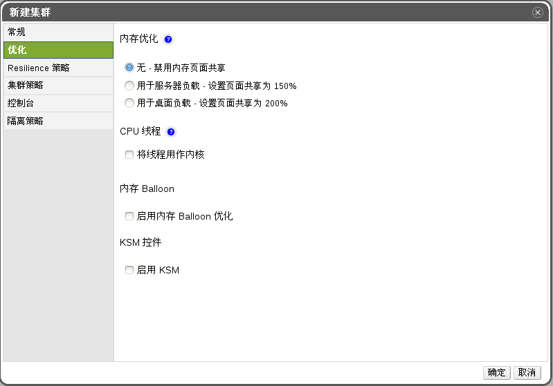

# 优化选项解释

内存页共享允许虚拟机通过使用其它虚拟机未在使用的内存，使得这个虚拟机可以使用高达为其分配的内存的两倍之多。当然想要实现这样的功能是有条件的，那就是在 EayunOS 企业级虚拟化环境中，不是所有虚拟机都同时处于满负荷运转的状态，这样才会允许那些暂未使用的内存分配到一个特定虚拟机上。

CPU 线程处理技术允许主机上运行的虚拟机的 CPU 内核总数多于这台主机的内核总数，这个技术对那些不需要大量使用 CPU 资源的环境非常有用，
并允许大量的即将运行的虚拟机能够减小他们对硬件的要求。这个技术还可以让虚拟机运行一些在一般情况下无法实现的 CPU 的拓朴结构，尤其是在虚拟机的处理器的内核数量多于主机 CPU 内核数量且少于主机线程数量的时候。

**新建集群中的优化标签**

下面的表格描述了**新建集群**或**编辑集群**窗口中**优化**标签中的设置。

**优化设置**

| **填充项** | **描述/操作** |
| ---------- | ------------- |
| **内存优化** |<ul><li>**无 - 禁用内存页面共享**：禁用内存页共享。</li><li>**用于服务器负载 - 设置页面共享为 150%**：将内存页共享的阀值设置为每个主机系统内存的 150%。</li><li>**用于桌面负载 - 设置页面共享为 200%**：将内存页共享的阀值设置为每个主机系统内存的 200%。</li></ul>|
| **CPU 线程** | 选择**将线程用作内核**复选框，则表示允许主机运行 CPU 内核总数多于主机 CPU 内核数量的虚拟机。  暴露的主机线程可以被当作虚拟机能够使用的 CPU 内核。例如，一个 24 核的系统，且每个 CPU 内核有 2 个线程，即这个系统共有48 个线程，也就是说其上运行的每个虚拟机都可以有 48 个 CPU 内核。那么虚拟机就可拥有 24个core，但是带来的后果就是，CPU负载的计算算法将是平时的2 倍。|
| **内存 Balloon** | 选择**启用内存 Balloon 优化**复选框表示允许运行在集群中主机上的虚拟机可以有“内存过量使用”的功能。当该选项启用后  Memory Overcommit Manager (MoM) 会在情况允许的情况下开启“ 气球操作” (Ballooning)，它的上限是每台虚拟机所具有的内存大小。  Bollooning 运行的前提是，虚拟机需要有气球 (balloon) 设备以及相应的驱动器。在版本在 3.2 及以上的集群中，每台虚拟机都会有气球设备，除非您手动删除了它。该集群中的主机状态变为 **Up** 时，它就会接收到一个气球策略更新。  另外需要特别强调一点，在某些场景下 bollooning 和 KSM 可能会有冲突。一旦冲突发生了，MoM 会尝试调整 balloon 的大小来减小冲突。另外，在其它的场景下 ballooning 还可能会引起虚拟机性能的下降。因此我们建议您谨慎使用 ballooning 优化功能。 |
| **KSM 控制** |选择**启用 KSM** 复选框将会允许 MoM 在必要的情况下且运行 Kernel Same-page Merging（KSM），还有如果 KSM 节约内存的好处要远大于为此付出的消耗 CPU 的代价时，也要运行 KSM。 |
